.. globalindex::

Use Windows Update and Ninite
-----------------------------

Software manufacturers update their programs all the time. Some of these
updates add features, but others are **security updates** released to
fix problems with the programs. People who write computer viruses
**exploit** these problems to spread their malware. Sometimes these
problems are so serious that simply visiting a malicious website can
infect your computer behind your back! So it is important to keep up
with security updates.

There are two kinds of security updates you should keep up with:

-  Security updates for Windows and Microsoft Office, which are released
   by Microsoft
-  Security updates for non-Microsoft software, such as Adobe Reader,
   Mozilla Firefox, or antivirus software.

Let's look at each of these in turn.

Microsoft Updates for Windows and Office
~~~~~~~~~~~~~~~~~~~~~~~~~~~~~~~~~~~~~~~~

Microsoft releases security updates for its products using **Microsoft
Update**. If you purchase a Windows computer from Computer Recycling
then this should be set up already, but you can confirm this for
yourself easily.

Press the Start button in the lower-left corner of your screen and
choose **Control Panel**:

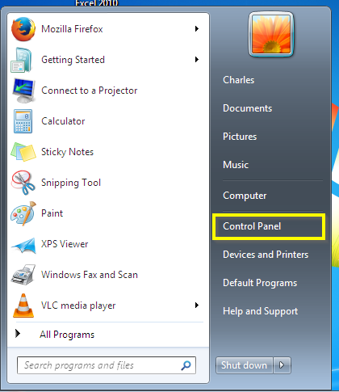

In the search bar, type "Windows update", and select "Turn automatic
updating on or off":

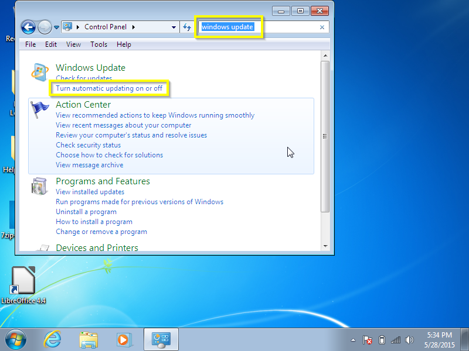

In the "Important updates" dropdown, choose "Download updates but let me
choose whether to install them". (If you leave your computer on all the
time you can choose "Install updates automatically". There are
situations in which other options are appropriate, but you probably
should not choose them. If in doubt, choose "Download updates but let me
choose whether to install them.")

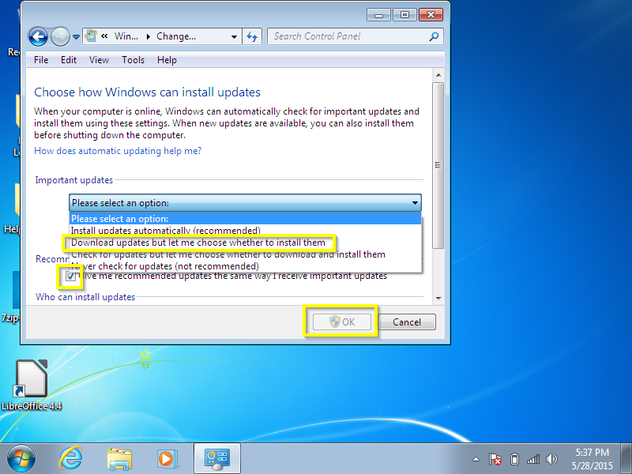

Click "OK", and put in the password for an administrator account.

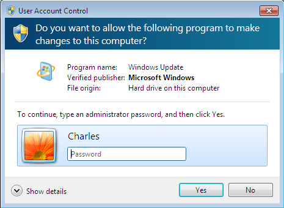

Now your computer will download Microsoft updates. Update notifications
will show up in the system tray at the bottom right hand corner of your
screen:

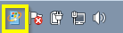

And you should see the yellow exclamation mark shield when you try to
shut down your computer:

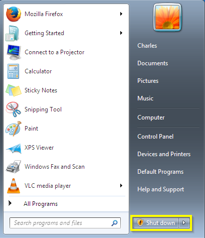

It is easiest to do updates by selecting the "Install updates and shut
down" option when you are done using your computer.

New updates are released at least once a month (generally on the second
Tuesday of the month, but sometimes in between as well). If it has been
a long time since you have seen update notifications, you can check for
updates manually. Go to Control Panel, search for "windows update" and
select "Check for Updates"

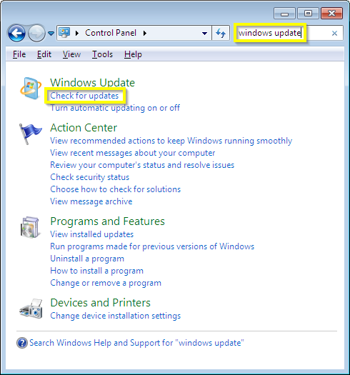

Your computer will connect to the Internet and indicate whether there
are any updates available. You can then install the updates if you wish.

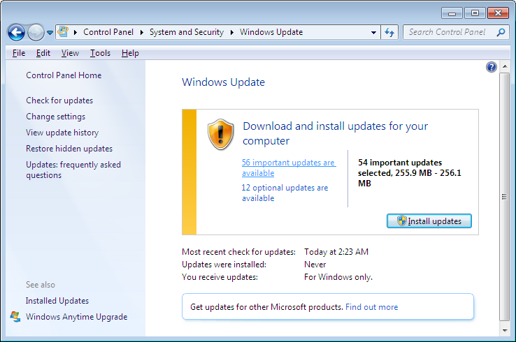

Non-Microsoft updates with Ninite
~~~~~~~~~~~~~~~~~~~~~~~~~~~~~~~~~

It can be even more important to keep up with non-Microsoft updates than
Microsoft ones, but in the past this was quite a hassle. You had to
visit many different websites for your software, download updated
versions of your programs, and avoid inadvertantly installing toolbars
and other junk that was bundled with the program.

Fortunately, things are easier now, for two reasons:

-  Some software (such as Adobe Flash Player, Google Chrome, and Mozilla
   Firefox) attempts to keep itself updated.
-  There is a software service called `Ninite <http://ninite.com>`_,
   which we at Computer Recycling highly recommend, and which is free
   (and legal!) for home users. We are so enthusiastic about Ninite that
   much of this handout might read like an advertisement for their
   service, but they are not paying us to promote them.

There is not much you need to do to take care of programs that update
themselves, so long as those programs are trustworthy. Using Ninite is
also not difficult, but there are a few steps involved.

If you have purchased a Windows 7 computer from Computer Recycling
recently,you might already have a Ninite installer on your desktop:

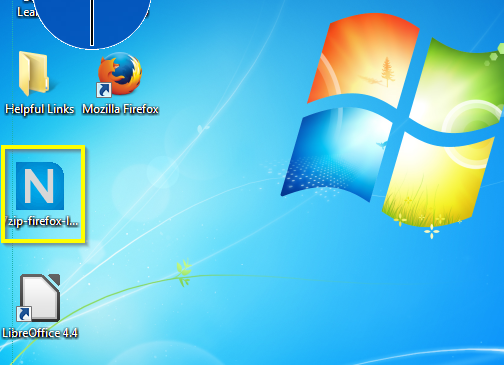

This installer will keep some of the programs we have installed for you
(Firefox, LibreOffice, VLC and a few others) up to date. To use it,
right-click the big blue N and select "Run as administrator". Then type
your administrator password and the updater will start working.

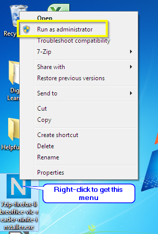

Ninite will then check for updates to the software registered with it,
and update software that is out of date.

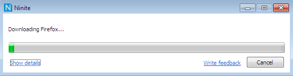

You can click "Show details" to see what the installer is doing.

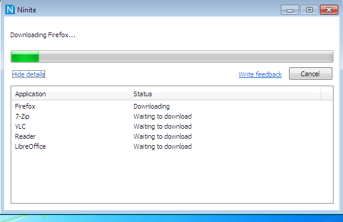

The only downside to this is that some software updates (in particular
LibreOffice) are large and can use a lot of bandwidth.

If your computer does not have a Ninite installer you can create one by
visiting https://ninite.com and creating one. See the [Downloads] [NEED
LINK] section for detailed instructions on doing this.

The home version of Ninite does not run by itself, so you should go
through this process at least once a month to keep your software update.
The company sells a version of their product for $10 USD a year that
will remind you when updates are available, but there is no obligation
to purchase this product.

