Use standard accounts for daily use
-----------------------------------

There are different kinds of accounts in Windows. **Standard accounts**
allow you to carry out day-to-day computing tasks (such as surfing the
internet, writing documents, playing music and video) without being able
to do administrative things that affect the entire computer (such as
installing or removing programs). This is important from a virus
perspective because it means viruses cannot be installed system-wide
behind your back. Using a standard account for daily computer reduces
the risk that a virus will infect your entire system.

The alternative to standard accounts are **administrative accounts**,
which can be used to install programs (including viruses, if you are not
careful).

We recommend having at least two accounts on your computer. One should
be a standard account that you use regularly. Another should be an
administrative account that you use for administrative tasks.

In Windows 7, administrative tasks are indicated with the following blue
and yellow shield:

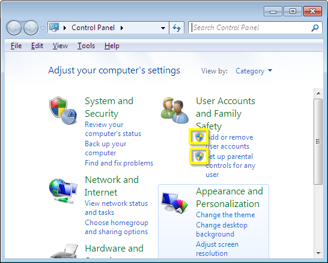

By default, clicking a task marked with this shield will darken the
screen and bring up the following prompt:

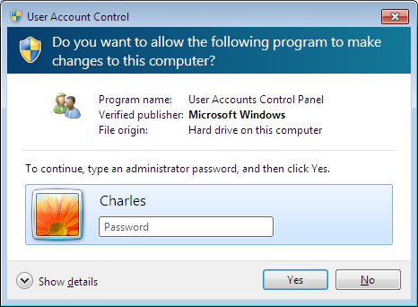

If you are logged in with a standard account, you will be prompted for a
password to an administrative account. Otherwise, you can click through
the prompt. The screen is dimmed using a Windows feature called **user
account control**, or UAC. We highly recommend keeping UAC enabled on
your computer. Sometimes Internet tutorials recommend turning off UAC
because it is annoying, but those Internet tutorials are dumb and you
should not pay attention to them.

Creating standard accounts
~~~~~~~~~~~~~~~~~~~~~~~~~~

If you are lucky, you are already using a standard account for daily
use. If not, you can create an administrative account and then make your
account standard. This will not protect you against all viruses (they
can still attack and mess up your personal account) but they won't be
able to affect your entire computer, which helps a lot.

To check the status of your account, click the Start menu, go to Control
Panel, and click "Add or Remove User Accounts":

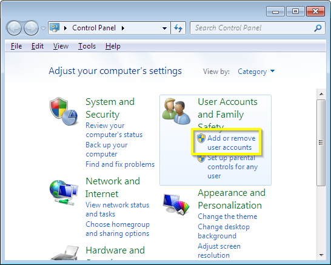

A list of accounts will show up. In this case, the "Charles" account is
the only administrator account.

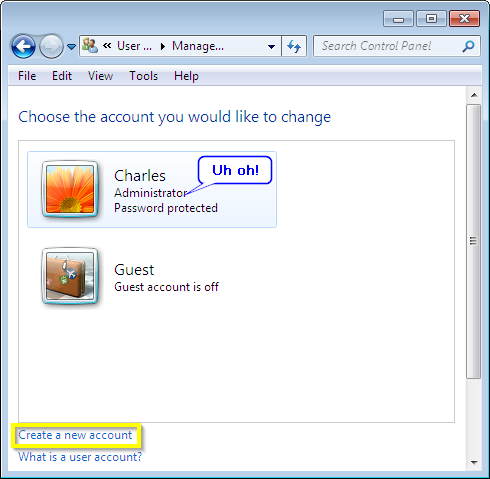

This is bad! Let's fix it by creating another account called
"CharlesAdmin" and make that an administrator account. Start by clicking
"Create a new account":

Choose a name for the new account. We will call ours "CharlesAdmin", but
you can name it something else (but not "Administrator", because that is
a reserved account in Windows). Make the type of account
"Administrator", then click "Create Account".

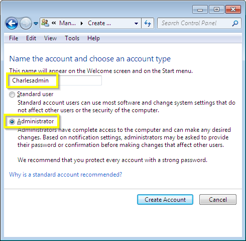

Now you will see your new account created, but it does not have a
password.

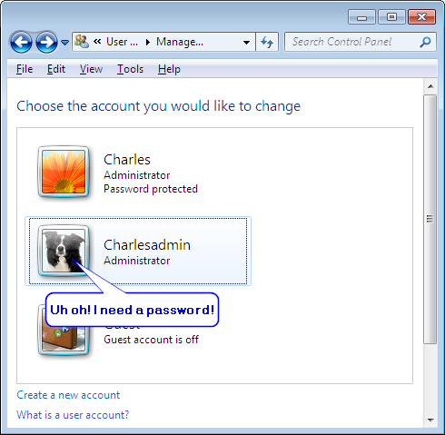

You will need to set a password for this account (which can be the same
as the password you already use, or something different. Different is
better if you can remember the new password.). Click on the account, and
then select "Create a password".

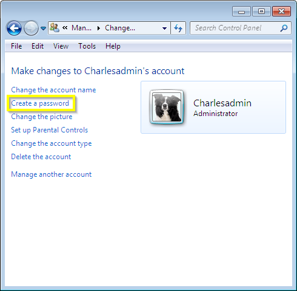

Enter the password twice, and do not enter a password hint.

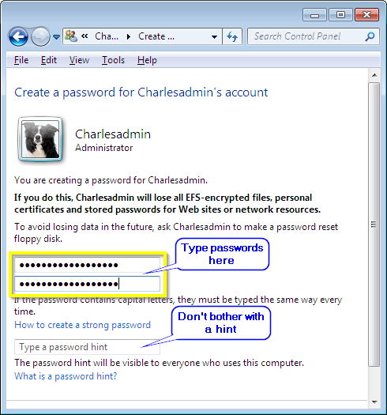

Now the admin account should have a password:

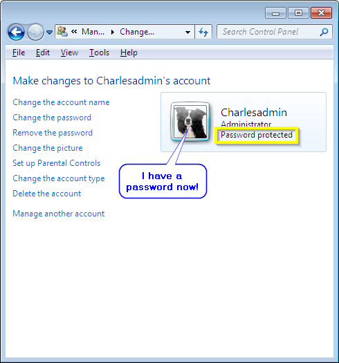

Next, remove the administrator permissions from your daily-use account.
Click "Manage another account".

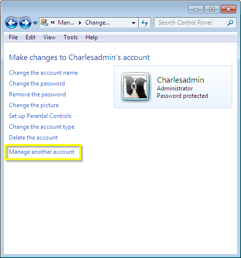

Then choose your old account:

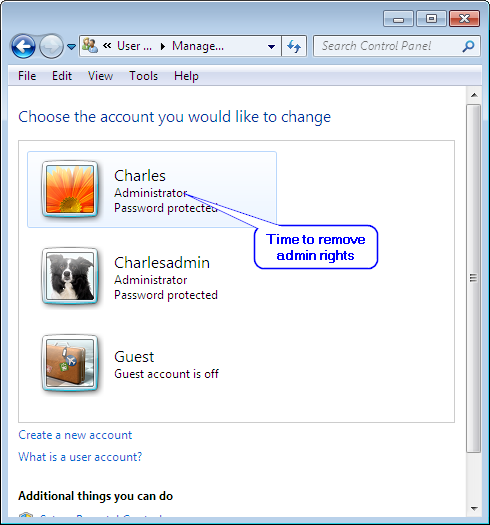

Click "Change the account type":

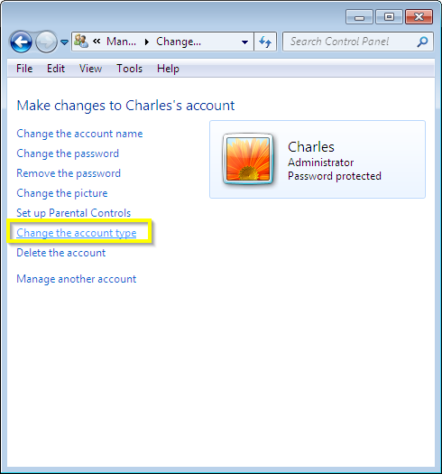

Next, make the account a "Standard user":

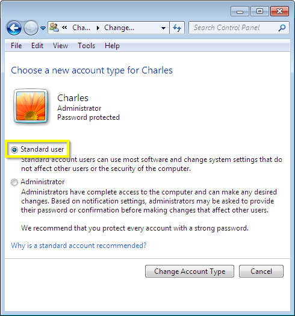

Then click "Change Account Type", and you are done.

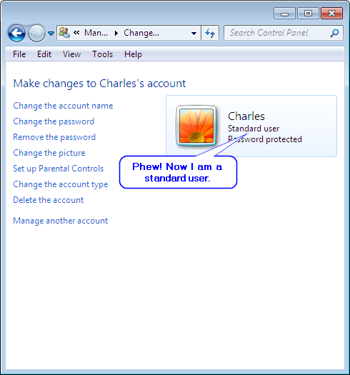

Changes will take effect once you log out and log back into your
computer.

Keep UAC enabled
~~~~~~~~~~~~~~~~

You will want to make sure that User Account Control is enabled properly
on your computer. To do this, click the Start Button, go to Control
Panel, and search for "UAC", then select "Change User Account Control
Settings":

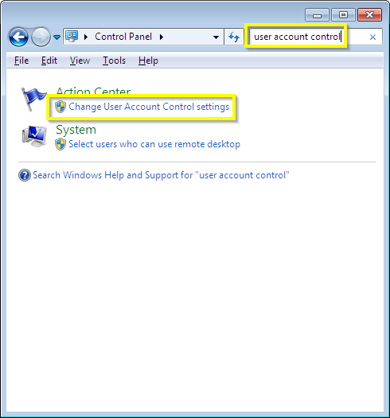

You will see a slider with four settings. Make sure the slider is set to
"Always Notify". Click OK and you are done.

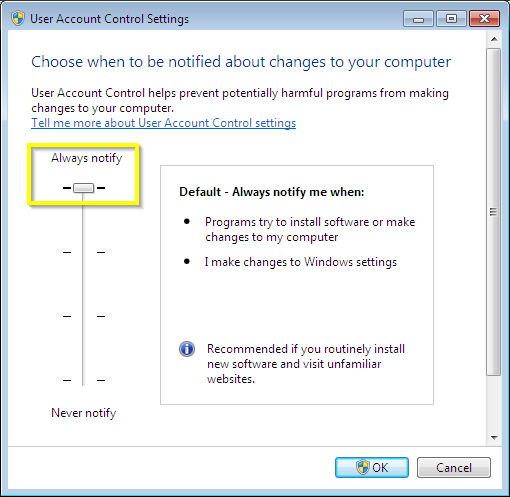

