Do your backups
---------------

Backups do not prevent viruses, but they can make it easier to recover
if your computer is infected. Some viruses are very destructive, and
will encrypt or delete your files so you can no longer access them.
Having good backups prevents you from losing everything.

We will look at three different kinds of backups in this document:

1. **System Restore** and **Previous Versions**, which backs up recently changed
   files. This is easy to configure, costs no additional money, and
   makes it easy to recover older versions of your files. However,
   System Restore will not protect you against disasters like lightning
   strikes or your hard drive dying, and typically System Restore will
   not back up everything long term.

2. **Windows Backup**, which can put backups on a USB flash drive, a second
   hard drive on your computer, or a remote location. This takes a
   little work to configure, but once set up it will back up your files
   regularly. This system costs a little money because you have to
   purchase something to back your data onto. These backups will help
   against viruses and your primary hard drive dying, but are still
   vulnerable to lightning strikes or computer theft.

3. Remote backups, which put your backups on a hard drive far away.
   There are many remote backup solutions, but we will look at a
   service called **MozyHome**, which is free for personal use and
   reasonably easy to configure. Remote backups can protect you against
   computer theft and lightning strikes, but they have disadvantages
   of their own: remote backups use up bandwidth on your internet
   connection. In addition, you have to trust the remote location
   where your backups are being stored: transferring your personal
   files over the internet makes it easier for others to see their
   content.

At the very least, we recommend enabling Previous Versions and Windows
Backup to a local drive. You can then evaluate whether you feel
comfortable storing backups to a remote service.

Your personal files are the most important things to back up, because in
general you can always re-download and reinstall programs and multimedia
files from the Internet. Most people care about backing up the following
things:

-  Their documents (which tend to be small and easy to back up)
-  Their pictures (which are bigger than documents, but can often fit on
   a single USB flash drive)
-  Their music and movies (which require lots of storage to back up)

Enable System Restore and Previous Versions
~~~~~~~~~~~~~~~~~~~~~~~~~~~~~~~~~~~~~~~~~~~

System Restore is usually enabled automatically, but you should check
that it is enabled and working. Start by clicking the Start menu, going
to Control Panel, and searching for "System Restore", then clicking
"System":

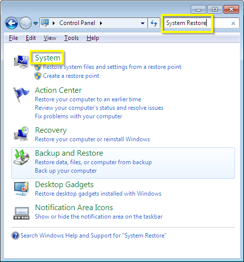

Next, click "System Protection"

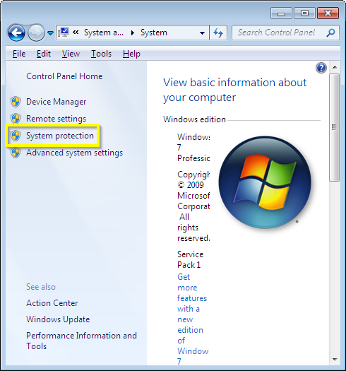

Make sure that your hard drives (at least Drive C:) have protection set
to "On". If not, click "Configure" and select "Restore system settings
and previous versions of files"

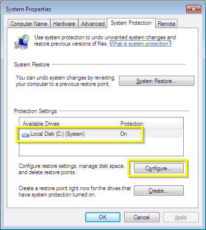

Once System Protection has been activated, you should be able to go to
individual files and see previous versions of the files that have been
taken. This process usually takes a couple of days to start, but we can
check that this functionality works by initiating a restore point. Start
by going to My Documents and making a document file by clicking the
"File" menu:

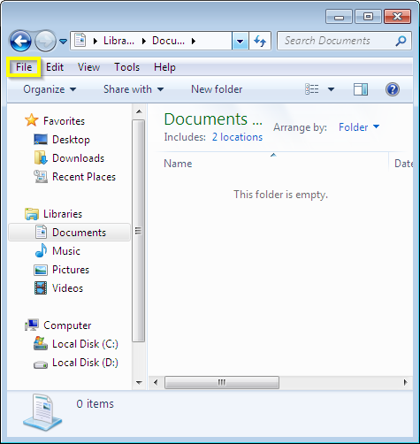

And then creating a new Text Document:

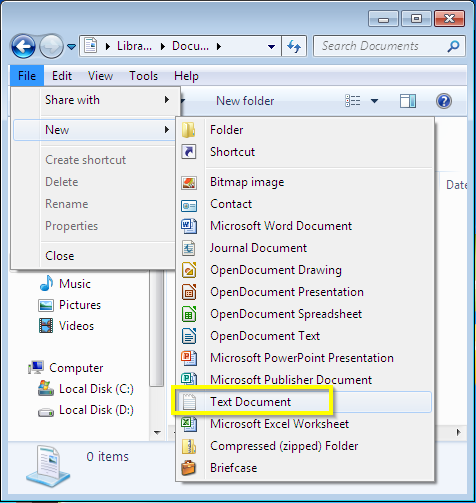

Give the document a name:

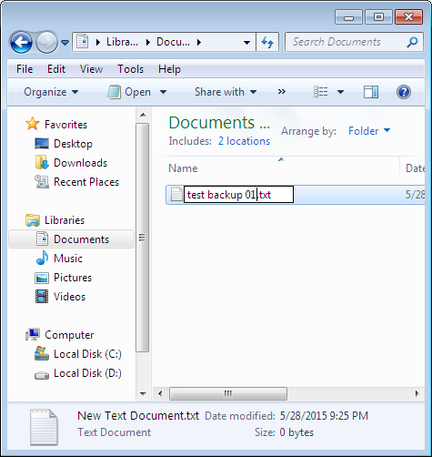

Double click the document to open it, and then put some text in the
document.

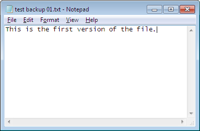

Save the document. Now go to the System Restore tab above and click
"Create":

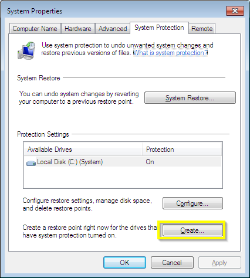

Give the restore point a name (it doesn't matter what):

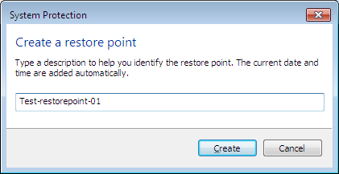

Wait a while for the system restore to complete. You should see that the
restore point was created successfully:

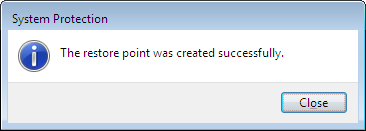

Next, re-edit your document and add some text, then save the changed
document.

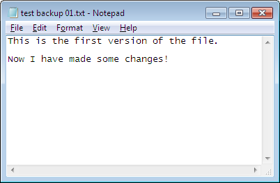

Now go back to your document, right-click it, and select "Properties":

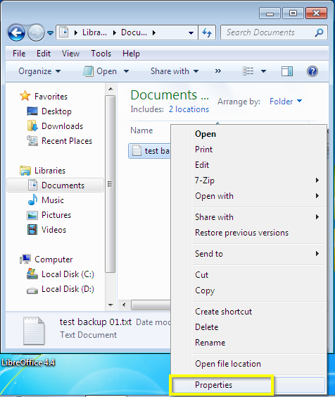

Click the "Previous Versions" tab.

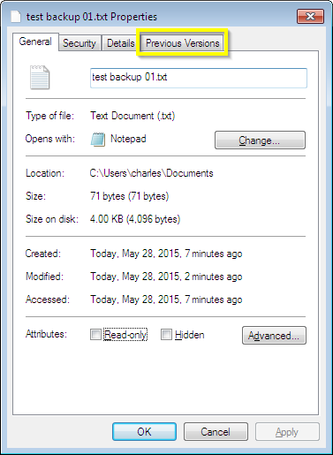

You should see there is a previous version of the document available.
You can then restore this previous version. To avoid overwriting the
current version, choose to make a "Copy" of the old version:

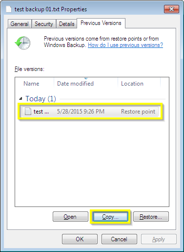

You are best off making a new destination for the restored file. In this
case we are making a "test restore" folder:

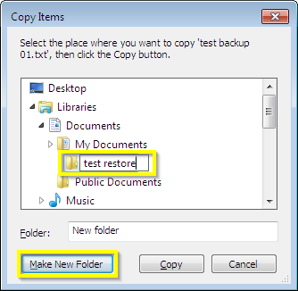

If you navigate to that folder you should see the old version of your
file.

Enable local backups to a USB flash drive
~~~~~~~~~~~~~~~~~~~~~~~~~~~~~~~~~~~~~~~~~

Windows Backup is built into Windows 7. You can use it in a variety of
ways, but we will focus on sending backups to a USB flash drive that is
permanently attached to your computer.

The first step is to purchase a new USB flash drive, and put it in your
computer. This drive will be used to store the backups. Any drive you
can purchase for $10 or more should have plenty of space to store your
documents and some of your pictures. The flash drive should be empty;
Windows Backup will be unhappy otherwise.

To start Windows Backup, click the Start button, go to Control Panel,
and search for "backup". Click "Back up your computer":

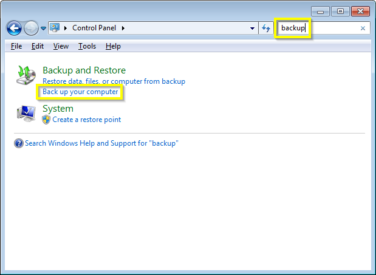

Click "Set up Backup"

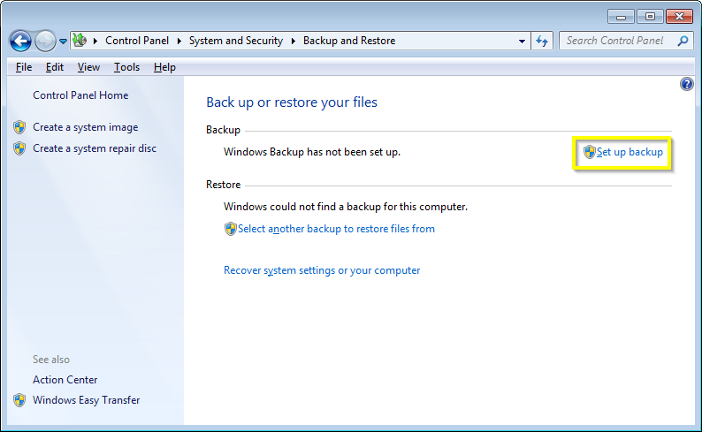

Now choose the USB flash drive as a backup location (in this picture it
is labelled "FLASHDRIVE", but it may labelled as "Removable Drive" or
something else):

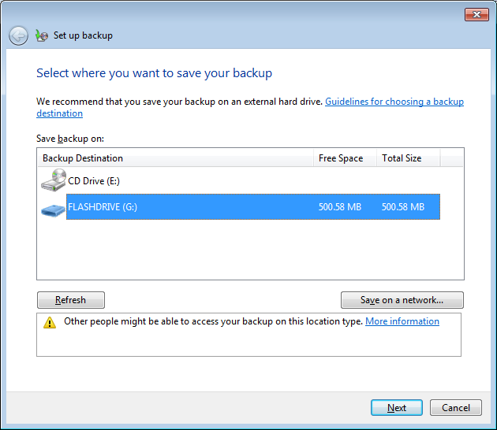

If you are backing up to a large device (such as a removable hard drive)
then you can let Windows choose what to back up. Otherwise select "Let
me choose"

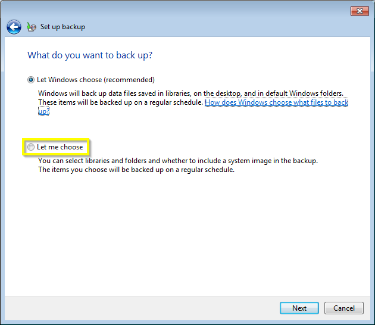

Now double click "All users". This should bring up a selection list.

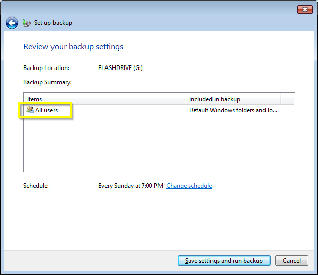

The most important things to back up are your "Libraries". If you are
backing up to a USB flash drive, then you want to back up at least the
"Documents" and "Pictures" libraries, assuming that is where you have
stored your documents and pictures. If you have stored large files
(movies, music) in your Documents folder then you will want to refine
the selections further.

.. figure:: pix/15-backups/10-usb/25-make-selections.png
   :align: center
   :alt: Unselecting Music and Videos

If you are backing up to a small device, you can unselect the Music and
Videos libraries:

.. figure:: pix/15-backups/10-usb/30-unselect-movies-music.png
   :align: center
   :alt: Unselecting Music and Videos continued

In general backing up more information is better than backing up less,
but you also do not want to run out of space on your backup device. When
you have made your selections, click "Next".

On the next screen you can edit the backup schedule. Ideally you would
choose a schedule when your computer will already be turned on. Click
"Change schedule" to choose an appropriate time. You should run the
backup weekly or daily.

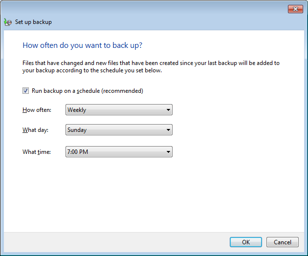

Click "Save settings and run backup".

.. figure:: pix/15-backups/10-usb/45-backup-in-progress.png
   :align: center
   :alt: Run initial backup

If you are lucky then the backup will complete successfully:

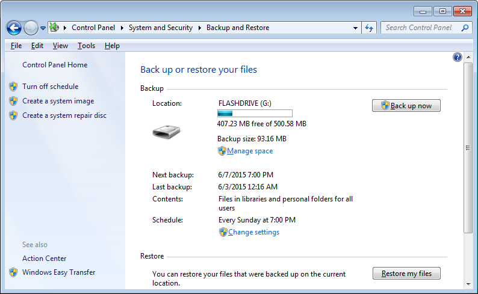

If your computer is off when the backup is scheduled, then the backup
should run the next time you turn on your computer. Note that you will
have to leave your USB drive plugged into your computer *permanently* in
order for this backup scheme to work.

Other ways to use Windows Backup
^^^^^^^^^^^^^^^^^^^^^^^^^^^^^^^^

In addition to backing up files onto a USB drive, you can also use
Windows Backup to:

-  Back up files to an external hard drive.
-  Back up files to a second internal hard drive you install in your
   computer.
-  Back up files to a Windows share on a different computer. This might
   be possible if you have a second computer or a media server at home.

Contact Computer Recycling if you are interested in exploring these
possibilities.

Enable remote backups using MozyHome
~~~~~~~~~~~~~~~~~~~~~~~~~~~~~~~~~~~~

There are many remote backup services. In this handout we will set up
one called MozyHome. This company allows you to back up 2GB of files on
their servers for free, which should be sufficient to back up important
documents. It is also installable using Ninite.

Mozy also offers paid plans if you would like to store more data on
their servers.

Note that as soon as you store your backups on somebody else's servers,
you are trusting that this company will not peek at your data. Many
backup companies promise that they do not look at your data, but as an
end user you have no good way to confirm this.

Note that Mozy (like other companies offering "freemium" services) makes
it tricky to install their free offerings. Their goal is to direct you
towards their paid products. Thus you have to jump through some hoops to
install their product. (There is nothing preventing you from paying them
for their service, of course!)

To get started, you first need to create a free MozyHome account. To do
this, visit https://mozy.com/free :

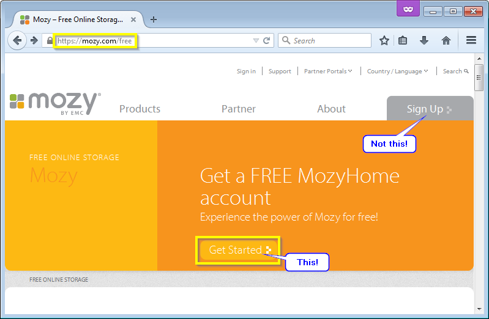

Note that Mozy will make it difficult to create a free account unless
you use the https://mozy.com/free page. Clicking the "Sign up" link will
direct you to create a paid account, so don't do that. Instead, click
"Get Started".

You are first prompted to enter your country of residence:

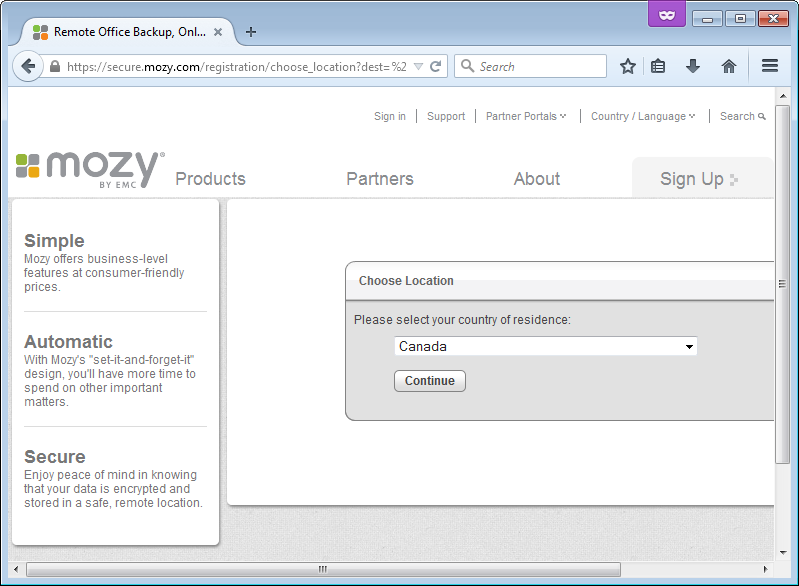

Enter your email address and choose a password.

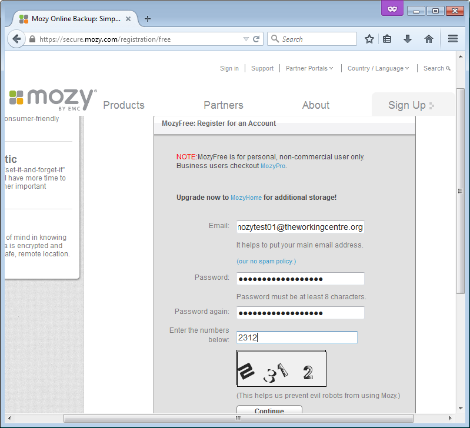

You should then see a prompt to check your email:

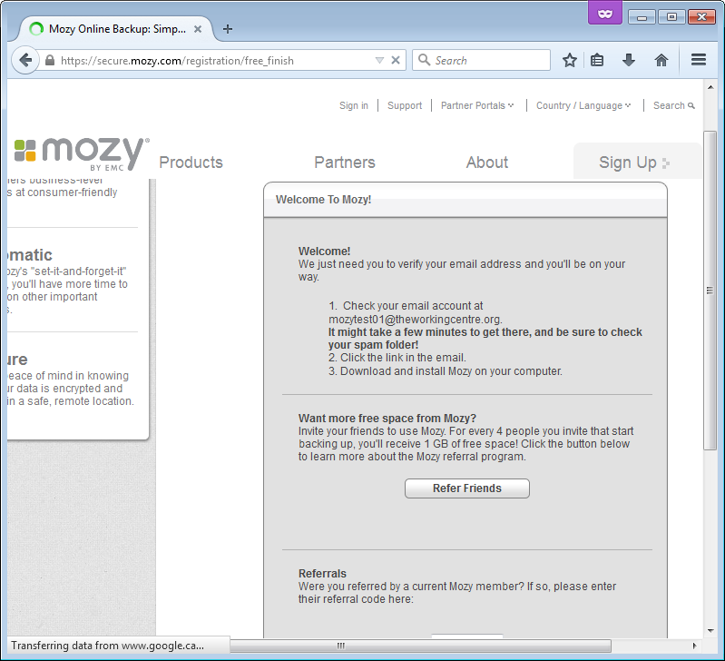

When you do so, you should see an activation link from Mozy. Often you
want to be careful about clicking links in email (see the
":ref:`20-downloads-email-links`" section below) but in this case you are 
expecting a registration email:

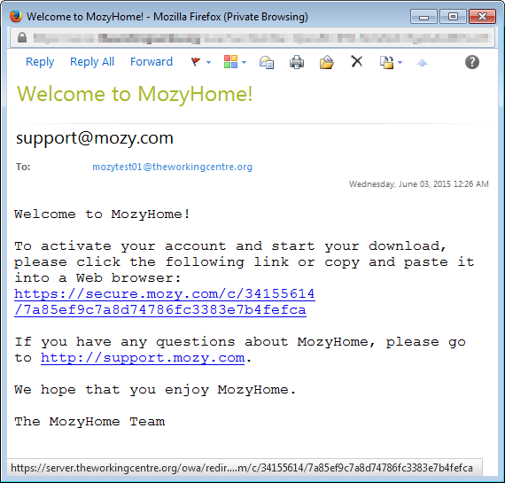

After clicking the link you should see a confirmation that your account
has been created. You do not need to do much with this account, but you
may want to look in the "Manage Account" section and unsubscribe
yourself from Mozy emails.

On this page you will also see a link that you can use to download the
Mozy client software. You can click that link and install Mozy if you
want, but there are a bunch of steps and you have to be careful about
not choosing a Mozy paid plan by accident. Instead, we recommend going
to Ninite (http://ninite.com) and using that to install the Mozy client
instead:

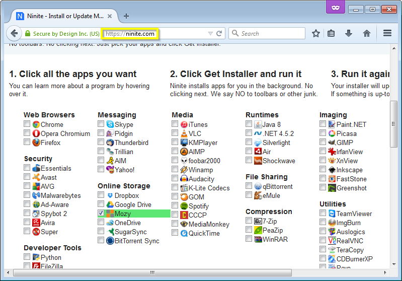

For more detailed instructions on using Ninite to install software, see
the :ref:`20-downloads-ninite` section.

Once you have installed the software, it is time to set up a backup. Log
in with the email account and password you created:

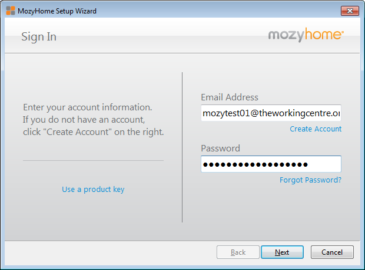

The next screen lists some files Mozy is offering to back up, and states
that Mozy will use "standard encryption" to back up your files. You can
use standard encryption if you want, but that means Mozy (and
potentially other entities on the Internet, such as government spy
agencies) can see your documents more easily.

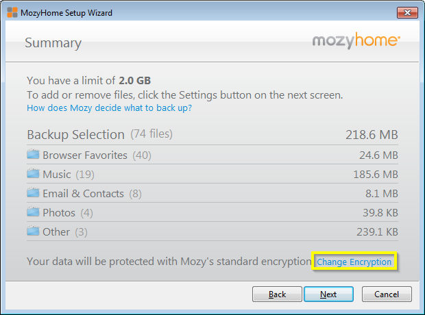

If you click "Change encryption" then Mozy will give you the option of
choosing your own password to protect your backups. If you use your own
password then Mozy promises that they will not be able to see the
contents of your backups, even under force of law. It also means that
you MUST put this password in a safe place. Putting the password on a
computer file is not sufficient, because your hard drive may be dead (or
your computer stolen!) when it is time to restore your backups.
According to Mozy, without this password you will not be able to restore
your backups when you need them.

If you value convenience over privacy, then you can leave the encryption
as-is. Otherwise, click "Change Encryption". You will see a warning
dialog:

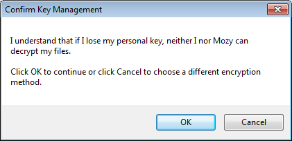

You will be prompted to choose a personal key (we have obscured the key
we typed, and you should keep your key a secret too!). The "Key" is just
a password you choose. You want to choose a strong password, and you
want to record it someplace where you can get it after your computer has
broken.

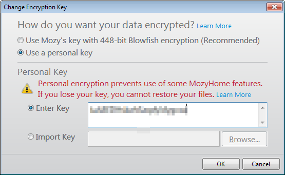

You will have the option to save your personal key (password) to a file.

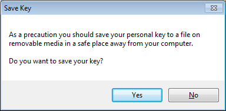

It might be a good idea to store this key on a secure USB flash drive or
in a password manager like KeepPass (See :ref:`35-other-keeppass` for
more information.)

Next Mozy will tell you that setup is complete, but you may want to
click the Settings button to change what is being backed up:

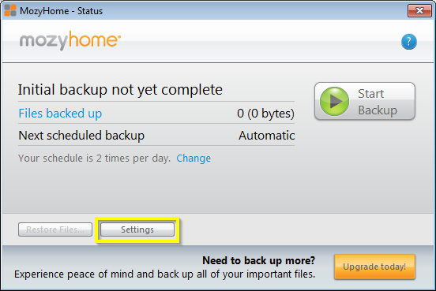

Go to "Backup Sets", and unselect "Music" and "Videos" if they are
large:

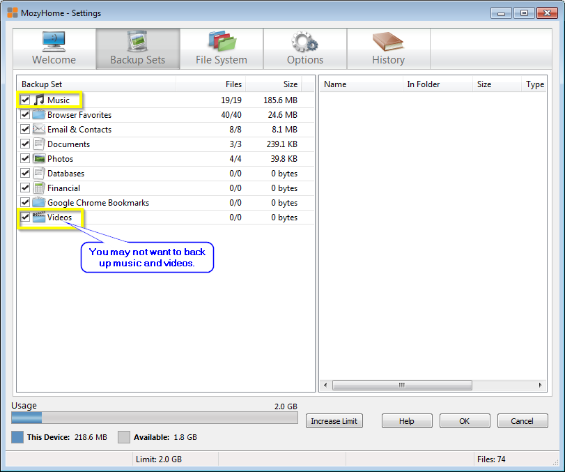

You will then have the option of choosing what files to back up. You
probably want to back up your Internet Favorites and Documents first. If
you have space, you can then back up photos. You probably will not have
enough storage space to back up music or video files to Mozy.

Now you can let the Mozy service do its first backup by clicking "Start
Backup" on the status screen:

By default Mozy will back up your files twice a day. You can change this
frequency. You will also want to be careful about how much bandwidth the
service is using to back up your files.

There is a Mozy icon in your system tray in the bottom-right corner of
your screen. You can click it to see your backup status or change
settings:

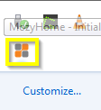

You can also open the Mozy client by clicking the Start menu and
searching for "mozy"

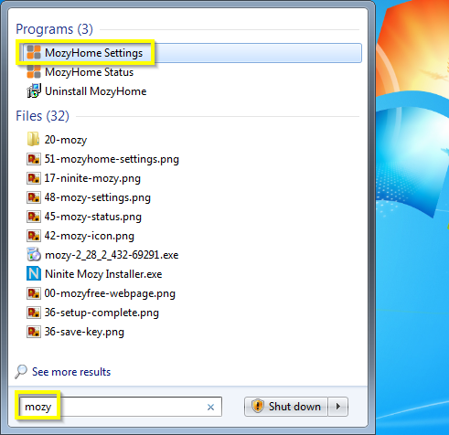

To restore files from Mozy, open the program and then browse to the
"Restore" tab:

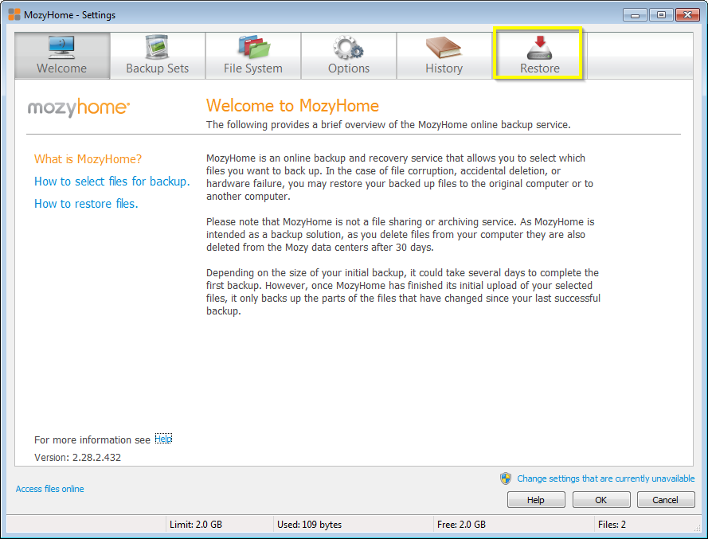

Mozy will keep up to thirty days worth of changes to your files, so if
you accidentally delete a file (or it is infected with a virus like
Cryptolocker) then you can restore it.

You probably do not want to overwrite your old files. Restore your files
to a different location, and then get rid of the damaged files once you
are sure the restored ones are adequate.

Choose the files you want to restore, select "Rename file if file
exists", and then choose to "Restore Files"

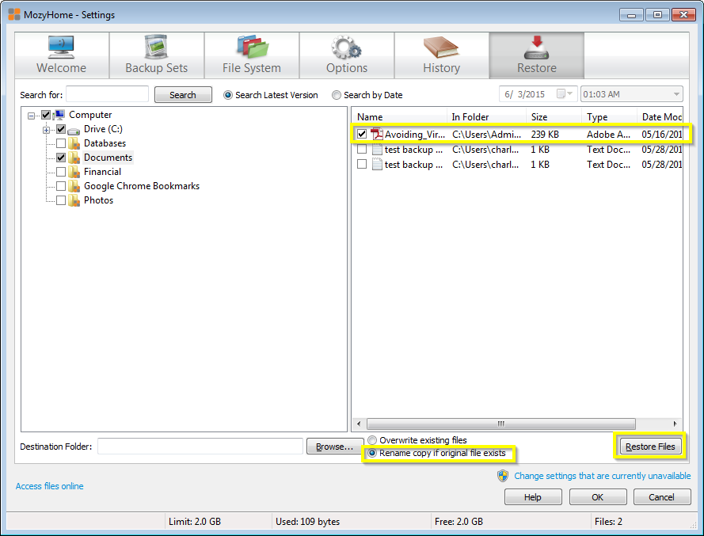

For more information on using Mozy, use the help option in the program:

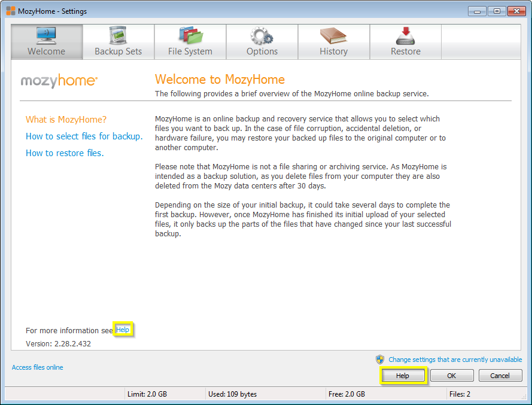

