.. _20-downloads:

Be careful about downloads
--------------------------

Some of the most common ways viruses get on computers are via web
surfing and downloaded programs. In this section we will look at some
of these infection mechanisms and how you can protect yourself from
them. 

Note that the advice in this section build upon previous sections. Using
out of date software or using administrator accounts for daily tasks
makes it easier for viruses to download themselves onto your computer.
Make sure you have implemented the steps in the previous sections
first. 

There are a lot of sketchy, misleading software sites on the Internet.
Some of them are outright scams: the software they offer comes preloaded
with viruses and other malware. Other sites make money by posting
misleading advertisements intended to make you download stuff you really
don't want on your computer.

Even legitimate software companies such as Oracle (which makes Java) and
Adobe (which makes Flash player) bundle questionable programs with their
plugins.

In this section we will cover some good practices for avoiding these
nasties.

.. _20-downloads-ninite:

Use Ninite for common downloads
~~~~~~~~~~~~~~~~~~~~~~~~~~~~~~~

One of the best resources for installing clean software is Ninite.
In the section :ref:`10-updates-ninite` we discussed re-running Ninite installers to keep your
existing software up to date, but you can also use Ninite to install new
software. Ninite does not include every piece of software you might ever
want to download, but it does include a selection of the most popular
programs and plugins. It also promises to keep its downloads clean of
toolbars and other unwanted bundles (and in our experience they have
kept this promise so far).

To install new software go to http://ninite.com. Scroll down to see the
list of programs:

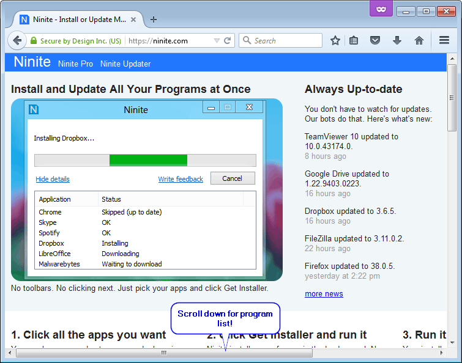

Select the set of programs you would like to install. If you already
have a Ninite installer, you can choose your new programs and also the
ones from your own installer, or you can just select new programs.

When you have chosen the programs you want, click "Get Installer".

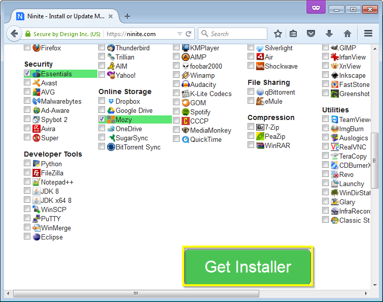

The installer should download to your computer.

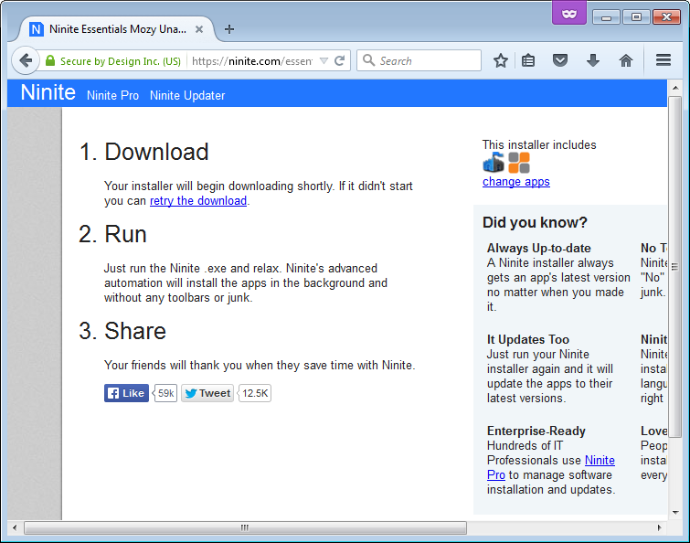

.. figure:: pix/20-downloads/05-ninite/10-download-dialog.png
   :align: center
   :alt: Save installer

Save this installer in a place where you can find it again. You can use
it to keep your software up to date. An easy way to find the installer
is to open the download location:

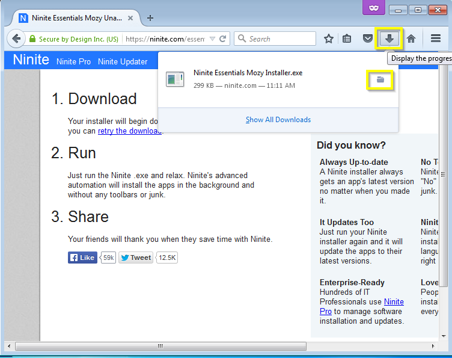

Finally, right-click the installer and choose "Run as Administrator" to
install your programs.

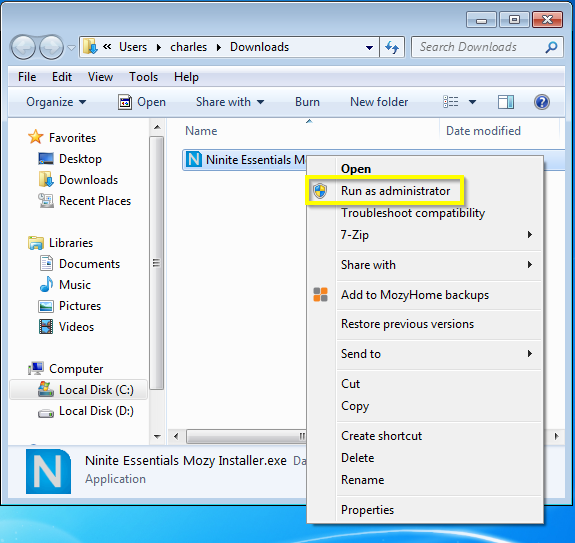

You will be prompted for an administrator password, and then you will
see the program downloading and installing files:

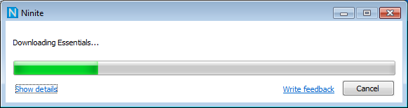

Click the "Show details" link to get more information about Ninite's
progress:

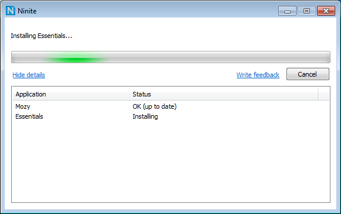

Not every program offered by Ninite is perfect, but it is our first
choice for recommended downloads (which is why we chose to recommend
MozyHome as our remote backup program).

To update your programs, simply run the installer as administrator
again. You do not need to go back to the Ninite homepage to re-download
an installer.

.. _20-downloads-adblock:

Install an ad blocker
~~~~~~~~~~~~~~~~~~~~~

Many viruses get on your computer when you click the wrong window on
your screen, or click a misleading advertisement that downloads unwanted
software to your computer. For this section, we'll use the example of
downloading a software program from a popular download site. This site
contains many misleading advertisements intended to trick you into
downloading things you do not want. 

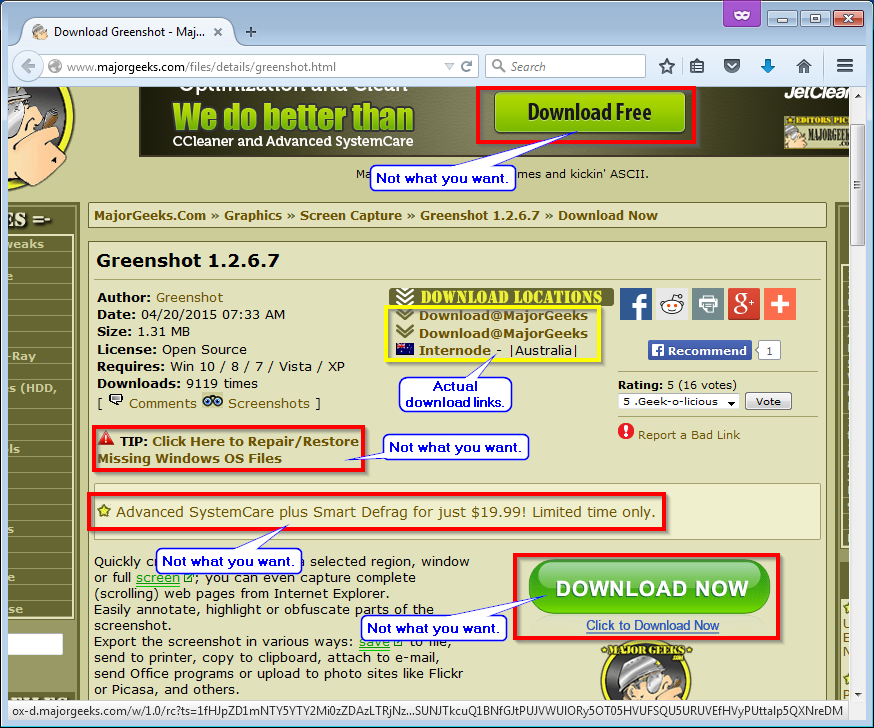

If you use an ad-blocking plugin for your web browser, many of these
malicious advertisements will not show up, making your web surfing. We
will demonstrate how to install the ad blocker AdBlockPlus for Firefox.

To start, run Firefox and navigate to Ad-Ons:

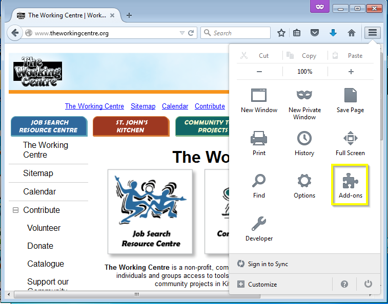

In the search bar, type "AdBlock Plus"

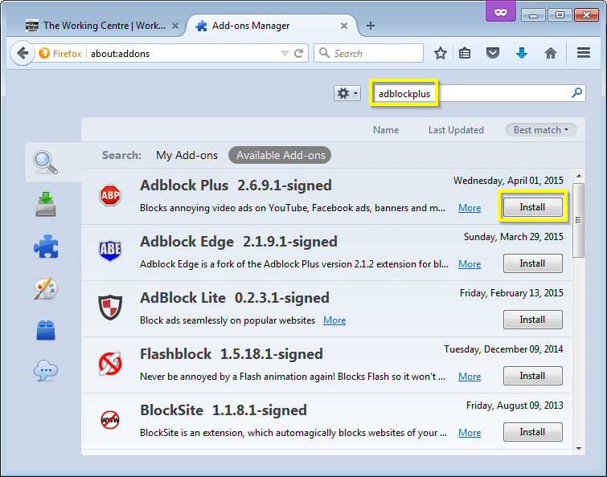

Choose the AdBlock Plus plugin and choose to install it. Be careful that
you choose the right product: as you can see there are many different
adblock plugins. Some of them are okay, but others might be malicious.

Once you have chosen to install the plugin, Firefox should then indicate
that the plugin is installed.

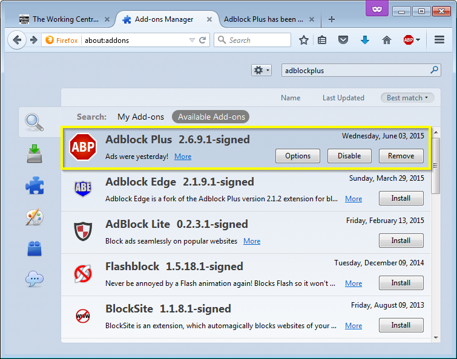

Ironically, the Adblock Plus website will then pop up in a browser
window:

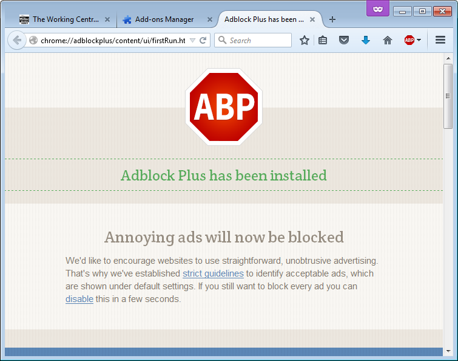

Now when you navigate to websites in Firefox, AdBlock Plus will block
obnoxious ads.

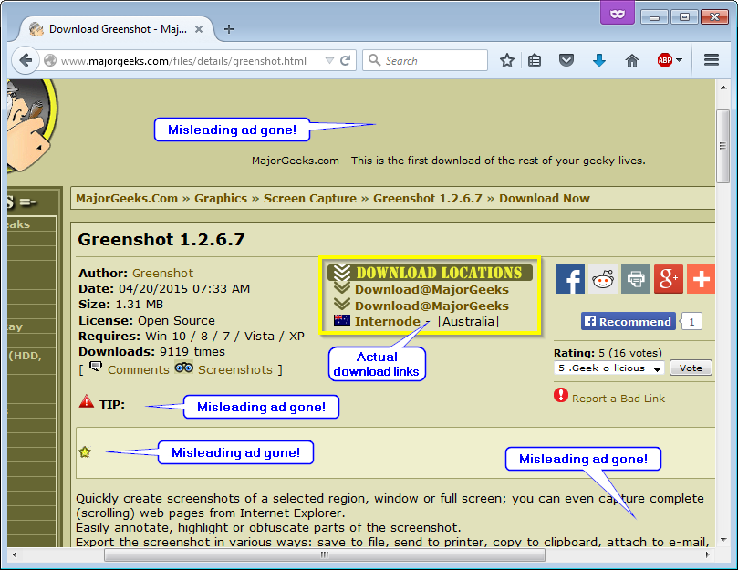

However, it will not block all advertisements. By default, it will
continue to display "non-obtrusive" ads:

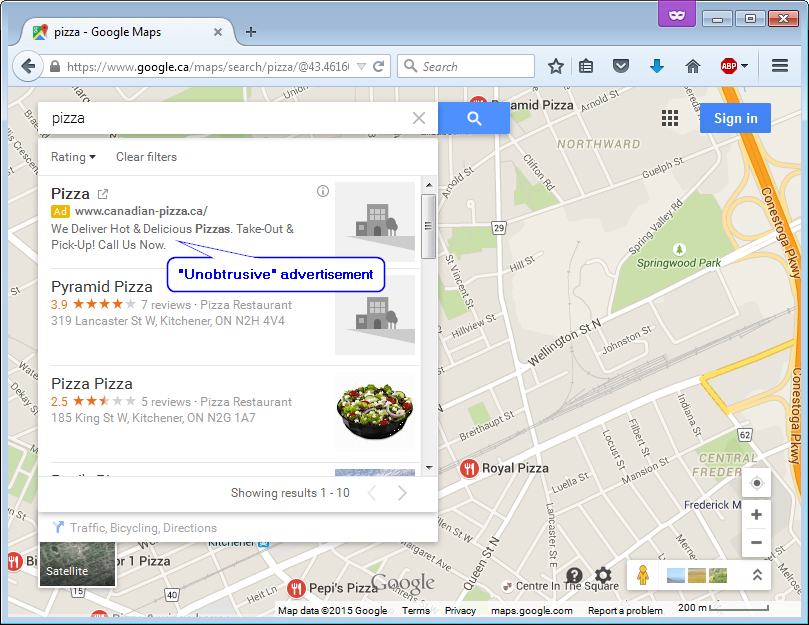

This brings up an important ethical issue.  Using an ad blocker is a
good practice to avoid scary popups and inadvertent downloads.
However, many internet sites earn revenue by displaying
advertisements, and when you use an ad blocker you deprive those
websites of their revenue stream. That means those websites could go
out of business, in turn depriving you of future content.

Thus, it might be advisable to allow websites that you like and trust to
display advertisements to you. To do this, you "whitelist" the website.
To do this, first navigate to the website.

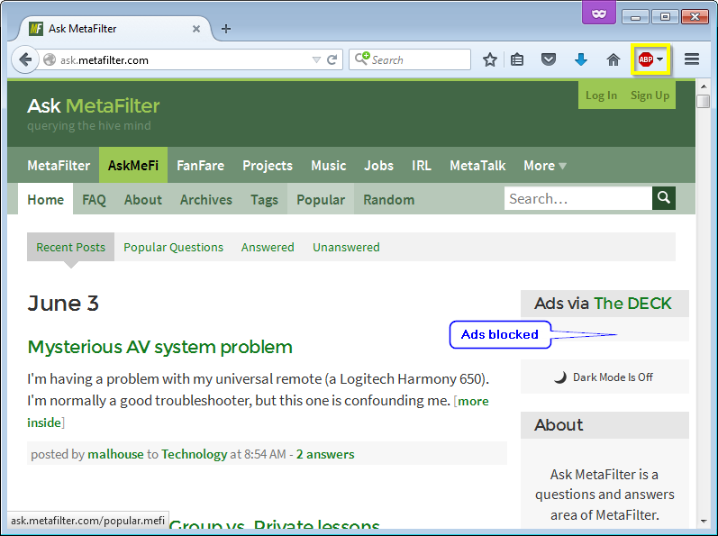

Choose the AdBlock Plus icon in the corner, and select "disable" for
this website:

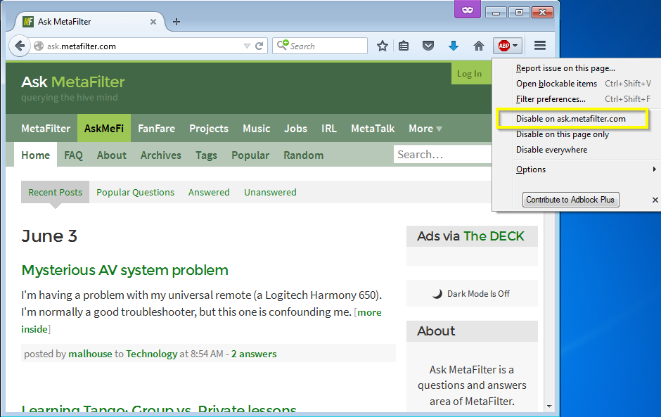

Then the website will be able to display advertisements to you.

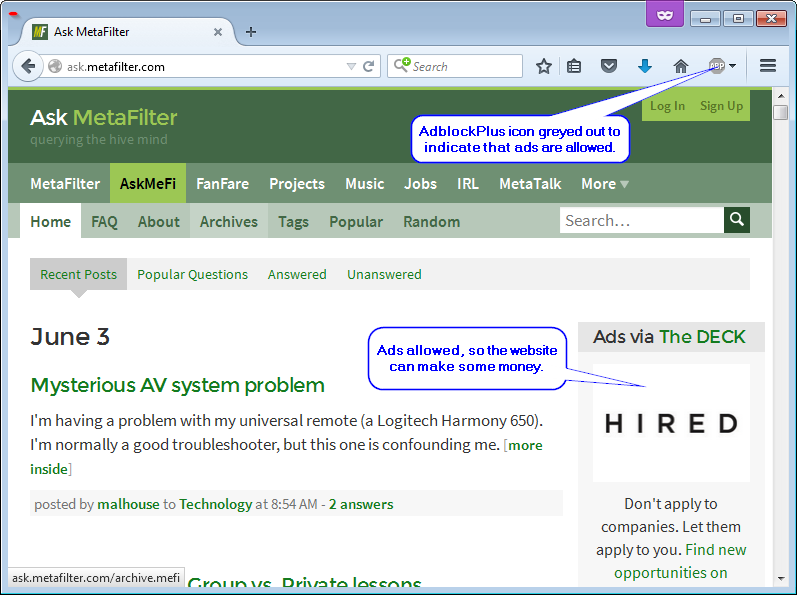

If you allow ads on trustworthy websites you enjoy, then it is less
likely that those websites will go out of business.

Unfortunately ethical issues around ad-blocking get even more
complicated. Most advertisements on the Internet 
track where you go and what you do while you are sufring the internet.
Some people are okay with this. Other people feel it is intrusive, and so use
ad blockers to block as many ads as they can. 

In addition, 
there is no guarantee that the ad-blocking software itself is
trustworthy! There are no easy answers to this quandry. You will have
to decide what ethical tradeoffs are right for you.

.. _20-downloads-email-attachments:

Be careful about email attachments
~~~~~~~~~~~~~~~~~~~~~~~~~~~~~~~~~~

Another common way viruses get on computers is by people opening
malicious email attachments.  Email providers are getting better about
screening out such attachments, but they are not perfect, and some 
virus-laden attachments still get through. 

Here are some rules of thumb to follow:

If you are not expecting an attachment, then do not open it. 

You should almost never open attachments that have two filename
extensions, such as .zip.exe .  Such attachments are named to confuse
you, and very often contain viruses.

Even if you get an email from a friend or relative you might be in
trouble. Be particularly wary if the email has strange wording or does
not sound as if it came from the recipient in question, or if the email
is asking you for money. In such situations the email account of your
friend or relative may have been hacked, and is sending out virus-laden
emails to everybody in their contact list. Here is a recent example: 

    Subject: Unhappy Predicament......................(Victim Name)
 
    HELLO,

    Sorry to bother you with this, I took a urgent visit to Ukraine to see my sick cousin who is suffering from a critical Uterine fibroid and must undergo a hysterectomy surgery to save her life. The news of her illness arrived to me as an emergency, she's going through a lot of pain at the moment and she needs family support to keep her going.

    The doctors have advised that it is necessary that the tumor is operated soon to avoid any complications. I hope you understand my plight and pardon me.The estimate for the Hysterectomy surgery is $9,000 USD. I have already spent approx. $6,200 USD cash towards her treatment so am wondering if you can assist me with a loan of $2,800 USD to make the necessary arrangement for the surgery to be carried out. Your help and support will give her a chance to live a normal life once again. I will surely pay you back as soon as I return. I will appreciate whatever you can help me with. Kindly let me know if you can be of help so I can send you my Money Gram details since I cannot operate my bank account from here.

    Sincerely (Victim Name)

These kinds of emails can be misleading, especially when they come
from somebody you know but do not correspond with regularly. 
This particular email did not come with an attachment (it was trying
to obtain money directly, rather than by installing a virus) but
similar messages often contain bad attachments.

If you are unsure about whether a particular attachment is safe to open
or not, you should contact the sender in question -- preferably over the
phone or an instant messenger program, not email! You can also contact
other friends or relatives of the person in question to see if they
have noticed anything amiss. 

.. _20-downloads-email-links:

Be careful about links in email
~~~~~~~~~~~~~~~~~~~~~~~~~~~~~~~

Distinguishing legitimate email from scam emails takes a lot of
practice. Often you will see plausible-looking emails containing links
for you to click. Here is an example:

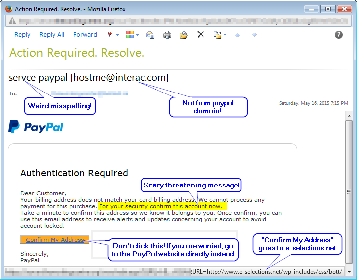

There are many clues that suggest this email is fake: 

- misspelled words
- pressure tactics to get you to click the link 
- an address of "hostme\@interac.com" instead of an address from paypal.com 
- the destination of the link going to a different web URL (you can see this
  by hovering over the "Confirm My Address" link)

Even if you do not catch any of these clues, you still should not click
links in emails you do not expect. If you are worried that the warnings
might be legitimate, go to the web service directly (in this case, go to
the PayPal website by searching for "paypal" in a search engine) and
then log in there. If the warning is legitimate you will probably be
able to confirm this after logging in.

If you don't have a PayPal account at all, then you can be sure that
this message is fake.

If the link is to a website then make sure the displayed link text
matches the link destination.

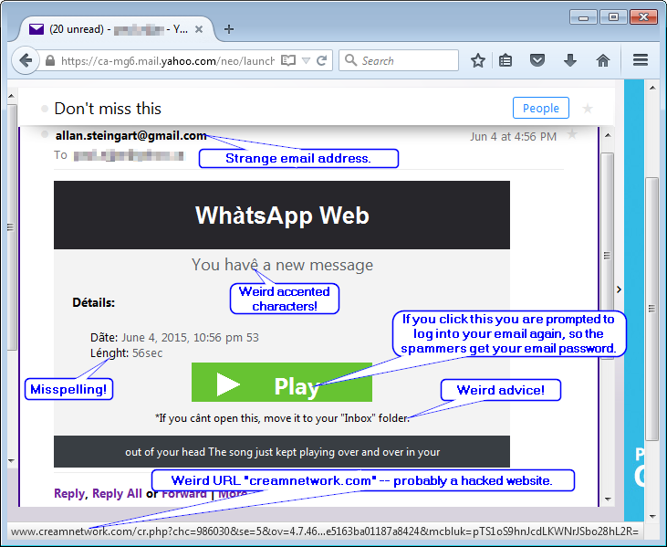

This message wants to fool you into thinking that somebody sent you a
link to a video via WhatsApp (a social networking platform). If you
hover over the link, however, it goes to "creamnetwork.com", which is
probably a hacked website. Sometimes the misleading links can be pretty
close to the real one. For example, instead of "whatsapp.com" a link
might be spoofed as "whatsapp.someotherwebsite.com".

It takes a fair amount of practice to learn how to distinguish fake
emails from real ones. And the problem is not limited to email! Spammers
have invaded Facebook, Twitter, blogs, and many other platforms, and all
of these platforms contain links intended to get you in trouble. But
even if you are not a computer genius, there are some rules of thumb
that can help keep you safe:

-  If you are not expecting the email in question, **don't click the
   link**.
-  If you get a link to a website in your email, **go to the website
   directly**, not by clicking the link.
-  If you get an email from a friend or family member that seems fishy,
   **don't follow instructions**. Spammers routinely break into email
   accounts and send spam emails to everybody in the victim's contact
   list.
-  If you do click a link and it takes you to a login page, **do not log
   in, and close your browser window**. Often such login pages are fake,
   intended to get your username and password.
-  If you click a link and it takes you to weird site, **close the
   window**.
-  If you click a link and it downloads a file to your computer, **do
   not open the file**. It could very easily contain malware that will
   infect your computer.

Be careful about links in social media
~~~~~~~~~~~~~~~~~~~~~~~~~~~~~~~~~~~~~~

Sometimes the social media accounts of your friends or family get
hacked. Then spammers use those accounts to send out status updates
containing suspicious links. When you click on those links, you are
taken to websites that try to break into your own social media account
(thus propagating the chain of breakins) or download other malware to
your computer. 

Because most social media websites use link-shortening tools, it can
be tricky to tell which links are legitimate and which are scams. Here
are a few rules of thumb: 

-  If one of your friends sends out a lot of links that seem
   uncharacteristic of that person (in terms of spelling, grammar, or tone) 
   then be wary.
-  If the links seem very generic ("Here is a great thing! I was so
   surprised!") then maybe they are suspicious. 
-  If somebody who does not post much suddenly starts posting a great
   deal, then be suspicious.
-  If you click a link and are taken to a website that seems very
   different from the blurb on the social media update, then you might
   be in trouble. Close your browser immediately.

Unfortunately this advice is not sufficient to stop all damage from
social media hacking, and it is becoming more and more difficult to
distinguish legitimate social media updates from spam and scams. Using
an antivirus product in conjunction with good judgement might be
helpful. 

.. _20-downloads-mirror-websites:

Be careful where you download software
~~~~~~~~~~~~~~~~~~~~~~~~~~~~~~~~~~~~~~

There are many places to get software on the Internet. Some websites
(such as download.com, MajorGeeks, and SoftPedia) serve as "software
mirrors", providing (possibly modified) copies of popular software
downloads. These websites show up high in web search results, so it is
easy to visit them when you are looking for software.

Many mirror websites use ads that try to mislead you into clicking links
for things you do not want. In the section
":ref:`20-downloads-adblock`"
above we saw one example of this. Here is another:

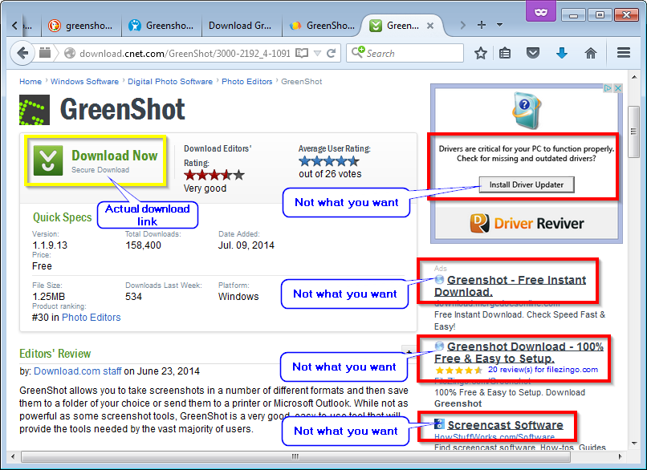

Other websites bundle toolbars and other undesirable software along with
the download you want. Often there is legalese on the site claiming that
you can opt-out of the extra software, but you have to look carefully:

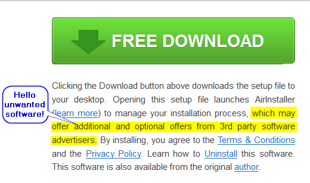

In addition, some mirror websites provide software that is out of date,
but that is a lesser concern.

Not all mirror websites are equally bad, but it is easy to be misled
when using them. Overall you are best avoiding mirror sites entirely. If
the software is available on Ninite, use that service instead.
Otherwise, look for the official software website:

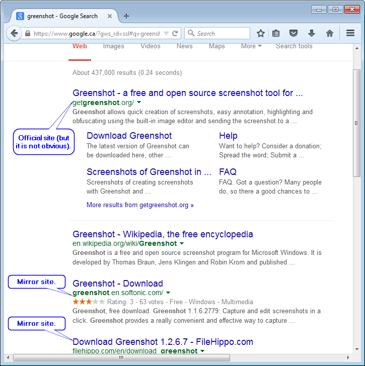

Unfortunately, you have to be careful even in this case, because
sometimes official downloads are bundled with toolbars and other junk.
The Greenshot software in this example does not, but other software
downloads do.

For example, this Java installer changes your homepage and search
provider, unless you remember to uncheck the box below:

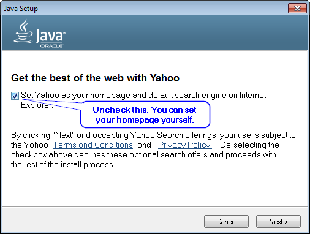

This download of Adobe Flash Player wants to install a McAfee plugin
along with it:

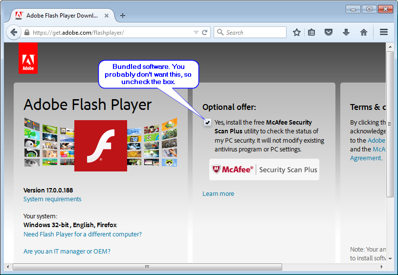

And this download of PDFCreator wants to install an "Ad-Aware Web
Companion", as well as changing your search provider to Bing:

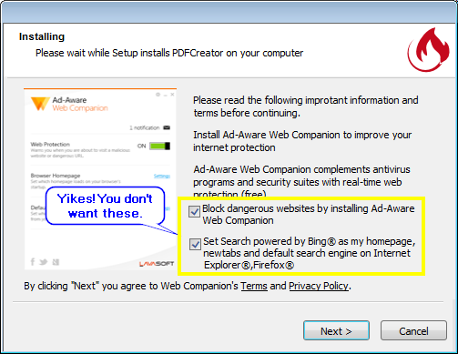

You almost always want to avoid installing this extra software with your
downloads.

Astute readers might notice that we recommend https://ninite.com, which
is also a sort of mirror website. As of this writing, we believe Ninite
does not engage in these kinds of questionable practices.

Once in a while you cannot find legitimate downloads on official sites.
In this case you may want to seek help. People at Computer Recycling can
help you locate legitimate downloads, or you may have a friend who is
both knowledgable about computers and whose judgement you trust.

Be careful about downloading games
~~~~~~~~~~~~~~~~~~~~~~~~~~~~~~~~~~

Games websites are especially prone to spreading malware. As always,
misleading websites offering "free games" can be suspect. 

If you (or your children!) are interested in getting games software,
some options are safer than others.

Access the Computer Recycling library
^^^^^^^^^^^^^^^^^^^^^^^^^^^^^^^^^^^^^

Computer Recycling has put together a library of games which we
believe to be malware-free. Many of these games are open source ones.
Please contact Computer Recycling to access this library of games. We
can put some installers on a USB key for you, or burn you a DVD of
them. 

Many of these games are less sophisticated than commercial videogames,
but lots of them are still fun to play.

Be careful about Flash games
^^^^^^^^^^^^^^^^^^^^^^^^^^^^

Many games use the Adobe Flashplayer plugin to run. Some game sites
are sketchy and some are less so. If you choose to play Flash-based
games then you should make sure that your copy of Flash Player is up
to date (Adobe releases updates for Flash player frequently). 

If you would like suggestions for safer Flash sites to use, please
contact Computer Recycling. 

Consider the Steam service
^^^^^^^^^^^^^^^^^^^^^^^^^^

There is a games service called Steam (http://store.steampowered.com)
which is popular with gamers.  Steam tends to sell commercial games
for money, but some games are free to play, and you are not obligated
to enter credit card information in order to create an account. You
can install the Steam client with Ninite: 

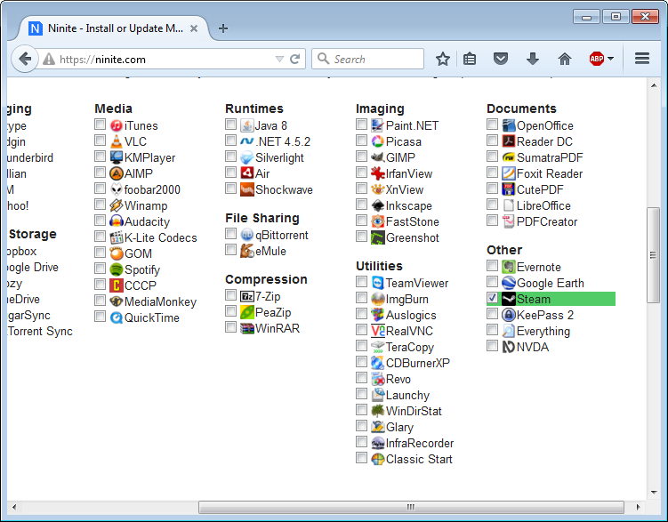

See the section on using Ninite for more information:
:ref:`20-downloads-ninite`

As far as we know, downloads on Steam are free of malware. 
You have to be careful when using Steam, however: 

-  Many of the games cost money, so you want to make sure you are only
   paying for products you want.
-  Even some of the games listed as "Free to Play" allow "in-app
   purchases", which means that the games encourage people to purchase
   items inside the game.
-  The games on Steam tend to be better suited for higher-end
   computers. 

Avoid toolbars
~~~~~~~~~~~~~~

Many programs come bundled with web browsing toolbars, such as the
Google Toolbar, the Ask Toolbar, the Bing Bar, or Conduit Search. For
the most part, these are bad news. At the very least they track your
movements on the Internet and report your activities to their central
servers. In worse cases they can infect your computer with malicious
software that is very difficult to remove.

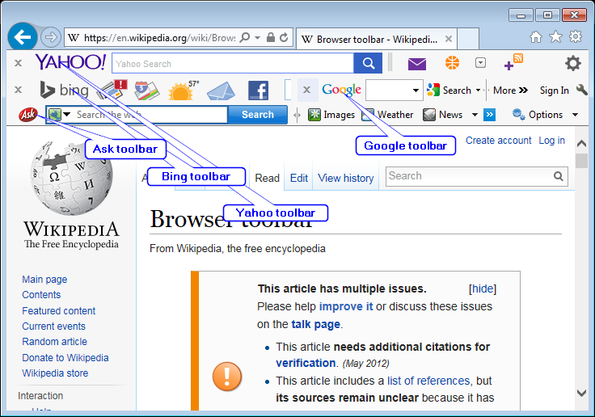

You do not need toolbars to surf the web effectively. You can use
favorites or bookmarks to visit websites you care about easily. You can
also change your preferred search engine easily. Contact Computer
Recycling if you would like help in doing these things.

Avoid pirated software and key generators
~~~~~~~~~~~~~~~~~~~~~~~~~~~~~~~~~~~~~~~~~

Some software is expensive. It is very tempting to download
illegally-distributed ("pirated") copies of this software from so-called
"warez" sites or torrents. Sometimes you might be tempted to download
key generating software that will activate demo versions of software
without you having to register or pay for the software.

As a general rule, this is a bad idea! Often the people who are making
illegal software available for download have ulterior motives. Many of
them want to make money, and one way to do so is by including viruses
along with the illegal downloads. People who have no moral compunctions
about redistributing other people's software often have no moral
compunctions about infecting your computer with viruses either.

Often there are free and legal alternatives to the software you are
looking for. These free alternatives may not be as sophisticated as the
commercial software you are tempted to pirate, but often they will get
the job done. One good resource for finding such software is the
Alternatives To site: http://alternativeto.net/

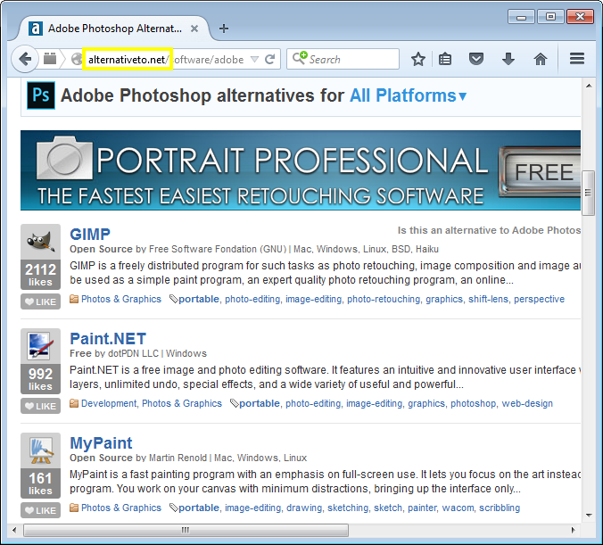

You can also ask knowledgable friends or volunteers at Computer
Recycling for suggestions.

When deciding upon alternative software, you want to make good choices.
Poorly-written or infrequently-updated software can also make your
computer more vulnerable to viruses. It can be helpful to ask yourself a
few questions:

-  Is the software regularly updated for security issues?
-  Do the software developers take security issues seriously?
-  Is there a sizable community of people who use the software and
   report problems?
-  Does the software work well? Does it do most of what you need?

