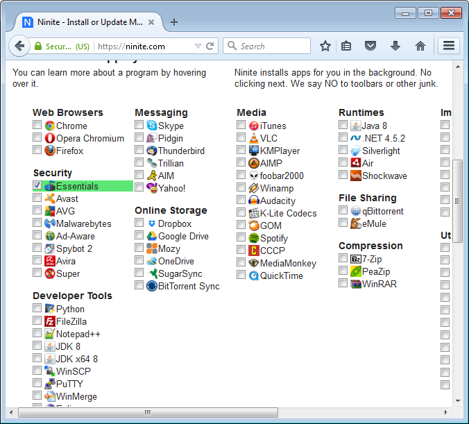

Keep your antivirus up to date
------------------------------

Antiviruses can help stop some virus and malware infections from getting
on your computer, but they do not catch everything. Practicing some of
the techniques listed above can help prevent malicious software from
being downloaded to your computer in the first place. In this sense,
antiviruses are a last defense.

There are lots of antivirus products on the market. Some of them are
free for home users, and others cost money. They do vary in quality.

If you are looking for a free antivirus, Microsoft Security Essentials
is a reasonable choice. It is available from Ninite, is legal for home
users to use, offers okay protection from viruses, and does not nag you
to upgrade to a paid product:

There are several other antiviruses available from Ninite: Avira, AVG,
and Avast. (And others?) Many of these products require registration to
work, and they will nag you to purchase their paid offerings, but they
might be sensible choices as well:

.. figure:: pix/25-antivirus/15-ninite-otherantiviruses.png
   :align: center
   :alt: Other free antivirus products on Ninite

You might also choose to pay for an antivirus product, or you may
receive one in some other way (for example, you may pay for one via your
Internet Service Provider).

In general you only want to run one antivirus product at a time, because
two different antivirus products can fight with each other, making your
computer very slow. Having said that, there are some antimalware tools
that can be used to scan your computer manually. One product we like is
called MalwareBytes Antimalware:

.. figure:: pix/25-antivirus/20-ninite-malwarebytes.png
   :align: center
   :alt: MalwareBytes on Ninite

MalwareBytes does not include a realtime scanner, so it must be run
manually. This product can be good to run on a semi-regular basis (say
once a month) or if you suspect you may have been infected with
something.

