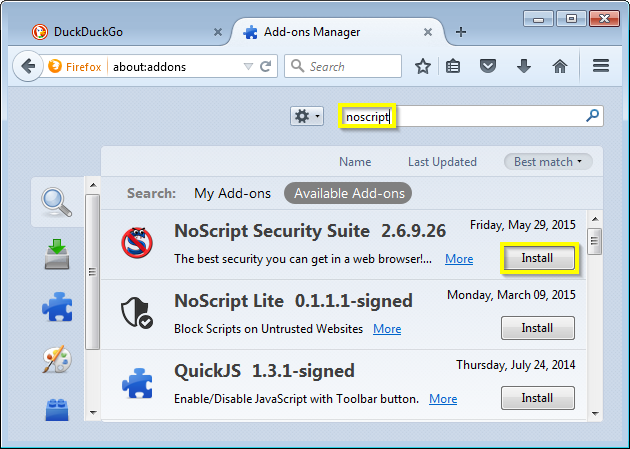
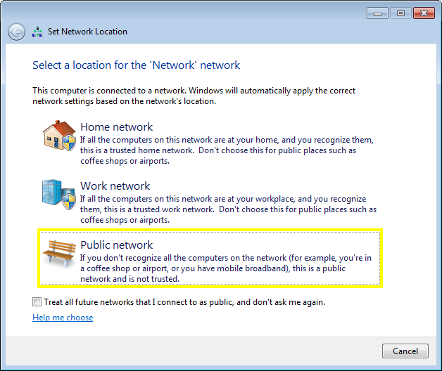
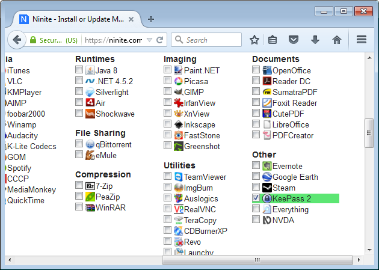
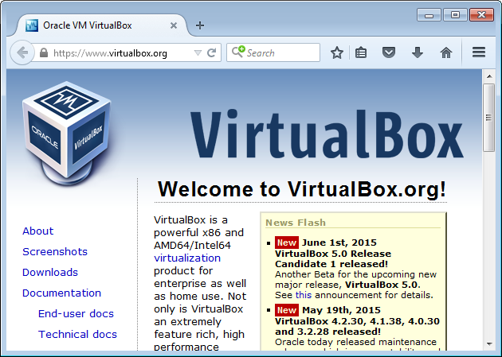

Other strategies to protect yourself
------------------------------------

In this document we have covered some easy, effective measures to
protect yourself from viruses and other malware. There are lots of other
things you can do, but often they take more patience and learning. In
this section we will briefly mention some of them. If you are interested
in pursuing them further, you can speak to the volunteers at Computer
Recycling. 

Restrict Javascript
~~~~~~~~~~~~~~~~~~~

Javascript is a programming language that is used extensively by
websites. Javascript is also used by people distributing viruses, so
blocking the use of Javascript in your web browser can go a long way to
protecting your computer.

One way to restrict the use of Javascript on your computer is via the
NoScript Firefox extension. This will allow you to selectively enable
and disable Javascript for particular websites.

Unfortunately, without Javascript many websites become unusable, so you
will have to spend time training the NoScript extension to allow
Javascript on websites you trust.

Be careful about wireless access
~~~~~~~~~~~~~~~~~~~~~~~~~~~~~~~~

When accessing the Internet using a public wireless connection such as a
coffee shop or the library, Windows will ask you whether the connection
in question should be "Work", "Home", or "Public". For these public
locations, you should choose "Public".

You should also be careful about what activities you conduct over
public wireless networks. In general, it is possible for others to
snoop on your web surfing when you are using public wireless
connections. 

.. _35-other-keeppass:

Use a password manager
~~~~~~~~~~~~~~~~~~~~~~

A password manager will not protect you from viruses directly, but it
will help you avoid using the same password for all of your services.
That way, if one of your online accounts gets compromised, the people
who made the virus will not get access to all of your other accounts as
well.

One password manager available on Ninite is KeepPass:

This password manager makes you choose one "master password", which
should be long but typeable. Then you can generate completely different,
completely random passwords for all of the other services you use.

Consider virtualization
~~~~~~~~~~~~~~~~~~~~~~~

Virtualization is kind of weird: it consists of software that emulates a
second computer on your computer. You can then install a second
operating system (called a "guest") on this emulated computer. This
allows you to do things like install a running copy of Linux on your
Windows computer, or install Windows inside Windows.

In terms of avoiding viruses, this can be helpful in two ways. Firstly,
this allows you to **sandbox** installations of troublesome software, so
that they cannot interfere with the rest of your programs. Secondly,
virtualization software provides **snapshot** capabilities that allow
you to roll back unwanted changes to your virtualized computer.

One commonly-used virtualization product is Virtualbox:

Unfortunately VirtualBox is not available on Ninite, so you have to
install the product from its homepage (http://virtualbox.org).

