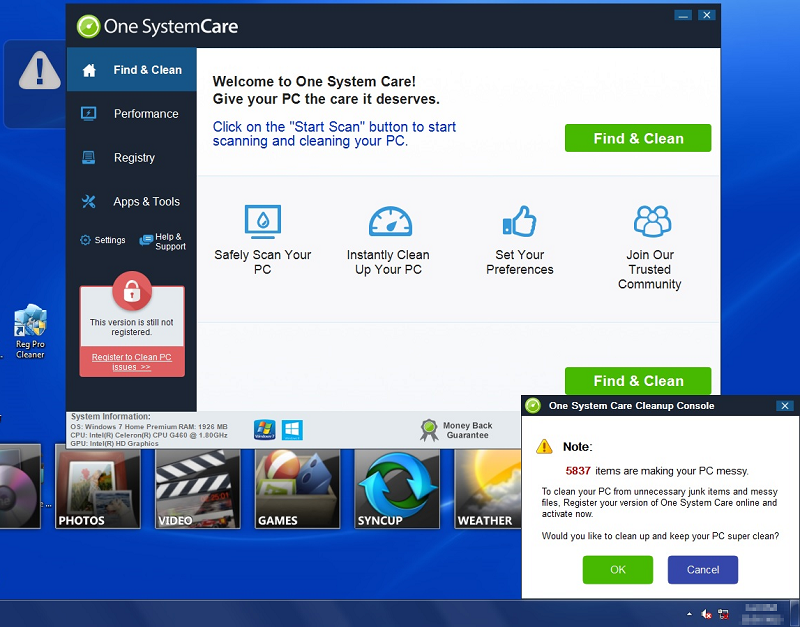
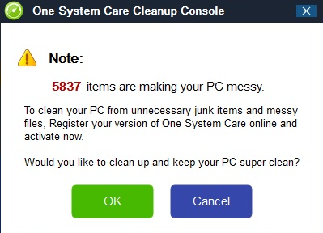
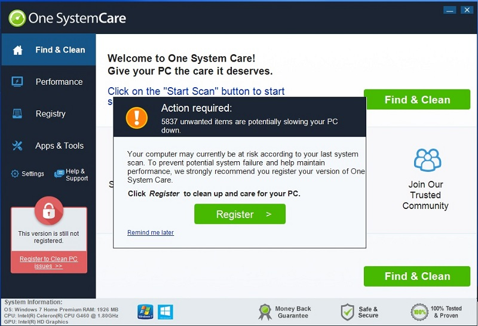

What are viruses and malware?
-----------------------------

Using the term "computer virus" is a little misleading -- there are many
kinds of **malware** you want to avoid, and technically not all of them
are computer viruses. Some types of malware you might hear about
include:

-  Ransomware, which tries to hold your data files hostage unless you
   pay the virus makers money.
-  Scareware, which pops up scary messages about how your computer is
   infected, or that the FBI has caught you visiting illegal websites,
   and that unless you install their product you will get in trouble.
   Following the advice of scareware is always a bad idea.
-  Worms, which try to spread to other computers.
-  Spyware, which reports your activities back to somebody else.
-  Keyloggers, which record what you type in your keyboard (including
   passwords!) and report it back to somebody else.
-  Botware, which takes over your computer and makes it part of a
   **botnet**: a network of computers under somebody else's control.
   Criminals often rent time on botnets (in other words: using your
   computer without your consent or knowledge) to do assorted illegal
   things.
-  Trojans, which are computer programs that make it easier for other
   malicious computer programs to be installed on your computer.

Pretty much all of these are bad news.

How do viruses and malware get on your computer?
~~~~~~~~~~~~~~~~~~~~~~~~~~~~~~~~~~~~~~~~~~~~~~~~

There are many different ways that viruses and malware can infect your
computer. Most often, it happens when you (intentionally or by accident)
download and install it:

-  You click on a bad link on a website or email.
-  You visit an infected website that installs software behind your
   back. This is much easier if your software is out of date and
   contains known exploits.
-  You download and run a strange email attachment.
-  You download and run some software which is bundled with a virus or
   other malware.

This is not a comprehensive list, of course. People devise newer and
scarier mechanisms for infecting computers all the time.

How can I tell if my computer has a virus or malware?
~~~~~~~~~~~~~~~~~~~~~~~~~~~~~~~~~~~~~~~~~~~~~~~~~~~~~

Unfortunately, you can't always tell! Some malware intentionally runs
in the background, and is intended to be unobtrusive. This can be the
scariest kind of malware, because it is difficult to detect and can
silently send your private information over the Internet or take
control of your computer behind your back. 

However, other viruses and malware are more obvious: 

- Some malware makes your computer slower in ways that were not
  happening before. Slow computers are not proof that your computer
  has a virus (computers can slow down for other reasons as well) but
  they can be a clue. 

- Your homepage mysteriously changes.

- Your computer starts popping up scary messages. 

- You are prevented from running regular programs until you pay some money to the malware manufacturers, telling you that your prirgams are "infected".

- You notice strange programs installed on your computer.

- Your antivirus program detects some viruses and alerts you about
  them. 

Example: System One Care
~~~~~~~~~~~~~~~~~~~~~~~~

This is an example of a "fake antivirus": a program that pretends to
detect problems on your computer, and then demands money to "fix"
those problems. If you pay them money then the problem usually gets
worse, not better!

This computer probably got this infection through an unintentional
download. Either the user clicked on a scary popup link, or this
program was bundled with another program the user intentionally
installed. 

First the computer pretends to scan the computer and find a lot of
problems: 

The box in the bottom corner claims that 5837 items are making th PC "messy". (Anybody who follows this program's recommendations will just make their PC messier!)

Of course, the program will not clean this computer for free. Instead it wants the user to register the program (and pay them in the process). 

Registering the software is exactly the wrong thing to do. Instead this is the point at which the virus needs to be removed. Having good backups is a big help in this situation, because it means that the computer can be wiped and reinstalled as opposed to trying to remove the malware manually.

Why do people create viruses and malware?
~~~~~~~~~~~~~~~~~~~~~~~~~~~~~~~~~~~~~~~~~

Some people create viruses for thrill and recognition. But these days
malware is often created for profit: individuals and organizations
look for information or money by using your computer. These groups
might try to profit from your misfortune in some of the following
ways:

- Holding your files for ransom until you pay them.
- Taking over your computer and using it as part of a **botnet**
  network, which can be rented to others for profit.
- Making your computer slow and/or scaring you into purchasing their
  software to "speed up your computer".
- Installing advertising and tracking tools, and then selling
  advertising space on your computer to others.
- Using your computer to send spam or host sketchy files.
- Using your identity to impersonate you and drain your bank account.
- Collecting information about your passwords and credit card
  information, which can be later sold online.

