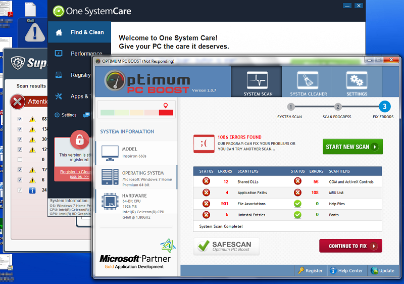

.. Avoiding Viruses and Spyware in Windows 7 documentation master file, created by
   sphinx-quickstart on Wed Jun 17 19:00:02 2015.
   You can adapt this file completely to your liking, but it should at least
   contain the root `toctree` directive.

Avoiding Viruses and Malware in Windows 7
=========================================

Getting computer viruses can be a real hassle:

-  They can make your computer slow and cause it to crash.
-  They can steal your personal information.
-  They can hold your personal data for ransom.
-  They can get you in trouble with your Internet Service Provider.
-  They can be expensive to remove. Computer Recycling charges a minimum
   of $25 to clean computer viruses. At other computer shops you can
   easily spend twice that much money.
-  They can take a lot of time to remove. Depending on the complexity
   of your repair and the number of other repairs in progress, taking
   your computer to Computer Recycling could leave you without your
   computer anywhere from a few days to a few weeks. 

The above computer was infected by three different fake antivirus
programs. It took hours to clean them all off. 
You don't want to end up in this situation!

It is much better to avoid being infected by a computer virus than to
clean up after one. This document outlines some easy steps you can take
to reduce your risk of being infected. The tips are in rough order of
importance. We will focus on tips that are both effective and easy to
implement. 

Although these tips will reduce your risk of computer viruses, there is
no way to guarantee that you will avoid them completely. New viruses are
being invented all the time, and the techniques used to spread viruses
are becoming more clever. However, the tips in this document will help
protect you against some of the more common threats. 

When we talk about "computer viruses" in this handout, we are actually
talking about all the kinds of **malware** that can get on your
computer. Technically some kinds of malware are not viruses, but we
don't have to worry about that distinction in this handout.

Some of the tips here are specific to the Windows 7 computers we sell at
Computer Recycling.

You might find some of the advice in this guide confusing or difficult
to understand. Please contact us at Computer Recycling if you are
confused so we can help you understand what is going on.

.. toctree::

   self
   05-updates
   10-accounts
   15-backups
   20-downloads
   25-antivirus
   30-support
   35-other
   40-aboutviruses
   45-credits

.. globalindex::
   :maxdepth: 4
