Introduction
------------

Getting computer viruses can be a real hassle:

-  They can make your computer slow and cause it to crash.
-  They can steal your personal information.
-  They can hold your personal data for ransom.
-  They can get you in trouble with your Internet Service Provider.
-  They can be expensive to remove. Computer Recycling charges a minimum
   of $25 to clean computer viruses. At other computer shops you can
   easily spend twice that much money.
-  They can take a lot of time to remove. If you bring your computer to
   Computer Recycling for virus removal, you could be without your
   computer for weeks.

It is much better to avoid being infected by a computer virus than to
clean up after one. This document outlines some easy steps you can take
to reduce your risk of being infected. The tips are in rough order of
importance.

Although these tips will reduce your risk of computer viruses, there is
no way to guarantee that you will avoid them completely. New viruses are
being invented all the time, and the techniques used to spread viruses
are becoming more clever. There are additional steps you can take to
reduce your risks, but in this handout we will cover the ones that are
both effective and easy to implement.

When we talk about "computer viruses" in this handout, we are actually
talking about all the kinds of **malware** that can get on your
computer. Technically some kinds of malware are not viruses, but we
don't have to worry about that distinction in this handout.

Some of the tips here are specific to the Windows 7 computers we sell at
Computer Recycling.

You might find some of the advice in this guide confusing or difficult
to understand. Please contact us at Computer Recycling if you are
confused so we can help you understand what is going on.

Use Windows Update and Ninite
-----------------------------

Software manufacturers update their programs all the time. Some of these
updates add features, but others are **security updates** released to
fix problems with the programs. People who write computer viruses
**exploit** these problems to spread their malware. Sometimes these
problems are so serious that simply visiting a malicious website can
infect your computer behind your back! So it is important to keep up
with security updates.

There are two kinds of security updates you should keep up with:

-  Security updates for Windows and Microsoft Office, which are released
   by Microsoft
-  Security updates for non-Microsoft software, such as Adobe Reader,
   Mozilla Firefox, or antivirus software.

Let's look at each of these in turn.

Microsoft Updates for Windows and Office
~~~~~~~~~~~~~~~~~~~~~~~~~~~~~~~~~~~~~~~~

Microsoft releases security updates for its products using **Microsoft
Update**. If you purchase a Windows computer from Computer Recycling
then this should be set up already [CHECK], but you can confirm this for
yourself easily.

Press the Start button in the lower-left corner of your screen and
choose **Control Panel**:

.. figure:: pix/05-updates/00-win/00-ctrlpanel.png
   :align: center
   :alt: Opening control panel

In the search bar, type "Windows update", and select "Turn automatic
updating on or off":

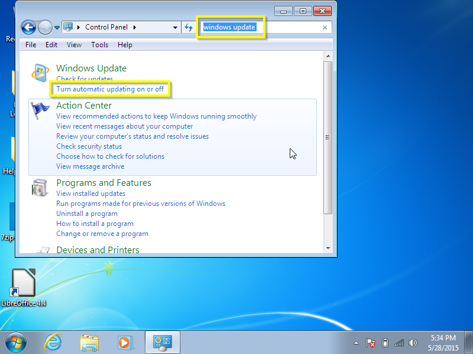

In the "Important updates" dropdown, choose "Download updates but let me
choose whether to install them". (If you leave your computer on all the
time you can choose "Install updates automatically". There are
situations in which other options are appropriate, but you probably
should not choose them. If in doubt, choose "Download updates but let me
choose whether to install them.")

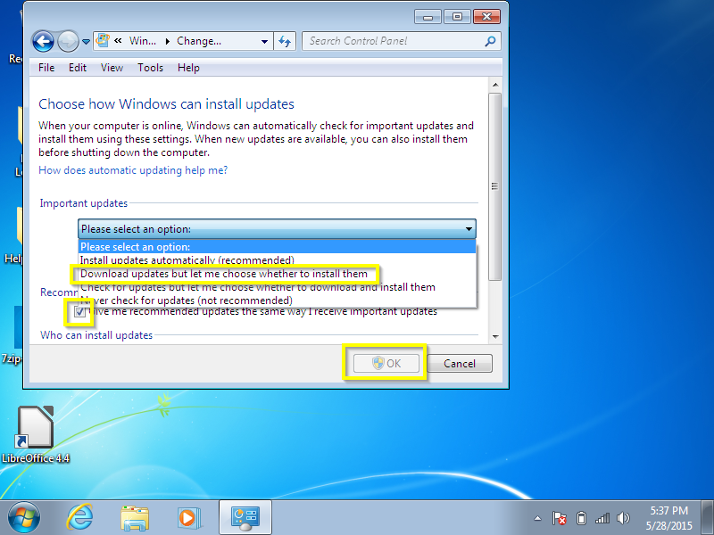

Click "OK", and put in the password for an administrator account.

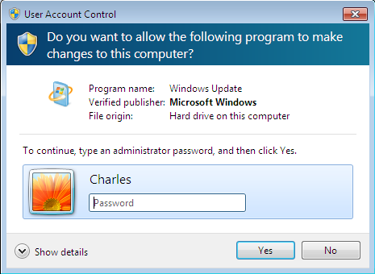

Now your computer will download Microsoft updates. Update notifications
will show up in the system tray at the bottom right hand corner of your
screen:

.. figure:: pix/05-updates/00-win/20-updates-available.png
   :align: center
   :alt: System tray notification for Microsoft updates

And you should see the yellow exclamation mark shield when you try to
shut down your computer:

.. figure:: pix/05-updates/00-win/25-start-menu-updates.png
   :align: center
   :alt: Shut down and install updates icon

It is easiest to do updates by selecting the "Install updates and shut
down" option when you are done using your computer.

New updates are released at least once a month (generally on the second
Tuesday of the month, but sometimes in between as well). If it has been
a long time since you have seen update notifications, you can check for
updates manually. Go to Control Panel, search for "windows update" and
select "Check for Updates"

.. figure:: pix/05-updates/00-win/30-check-for-updates.png
   :align: center
   :alt: Check for updates option

Your computer will connect to the Internet and indicate whether there
are any updates available. You can then install the updates if you wish.

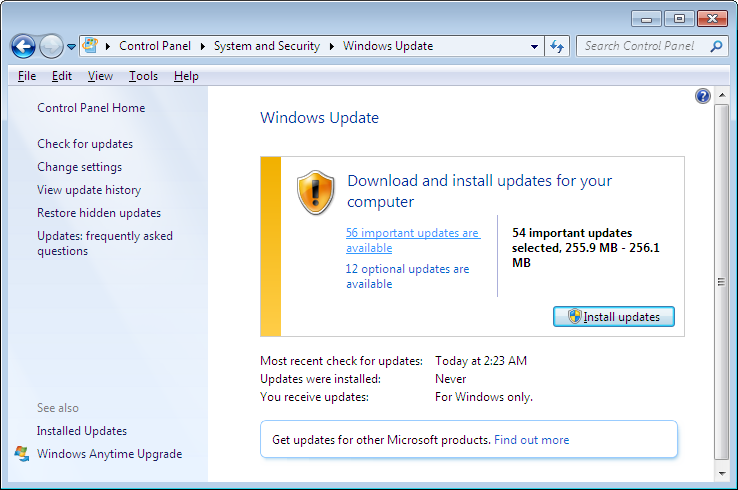

Non-Microsoft updates with Ninite
~~~~~~~~~~~~~~~~~~~~~~~~~~~~~~~~~

It can be even more important to keep up with non-Microsoft updates than
Microsoft ones, but in the past this was quite a hassle. You had to
visit many different websites for your software, download updated
versions of your programs, and avoid inadvertantly installing toolbars
and other junk that was bundled with the program.

Fortunately, things are easier now, for two reasons:

-  Some software (such as Adobe Flash Player, Google Chrome, and Mozilla
   Firefox) attempts to keep itself updated.
-  There is a software service called `Ninite <http://ninite.com>`_,
   which we at Computer Recycling highly recommend, and which is free
   (and legal!) for home users. We are so enthusiastic about Ninite that
   much of this handout might read like an advertisement for their
   service, but they are not paying us to promote them.

There is not much you need to do to take care of programs that update
themselves, so long as those programs are trustworthy. Using Ninite is
also not difficult, but there are a few steps involved.

If you have purchased a Windows 7 computer from Computer Recycling
recently,you might already have a Ninite installer on your desktop:

.. figure:: pix/05-updates/05-ninite/00-ninite-desktop.png
   :align: center
   :alt: Ninite icon on desktop

This installer will keep some of the programs we have installed for you
(Firefox, LibreOffice, VLC and a few others) up to date. To use it,
right-click the big blue N and select "Run as administrator". Then type
your administrator password and the updater will start working.

.. figure:: pix/05-updates/05-ninite/05-ninite-run-as-admin.png
   :align: center
   :alt: Run Ninite as administrator

Ninite will then check for updates to the software registered with it,
and update software that is out of date.

.. figure:: pix/05-updates/05-ninite/10-run-ninite.png
   :align: center
   :alt: Ninite running without details

You can click "Show details" to see what the installer is doing.

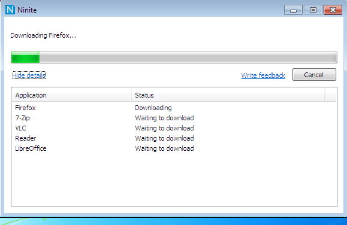

The only downside to this is that some software updates (in particular
LibreOffice) are large and can use a lot of bandwidth.

If your computer does not have a Ninite installer you can create one by
visiting https://ninite.com and creating one. See the [Downloads] [NEED
LINK] section for detailed instructions on doing this.

The home version of Ninite does not run by itself, so you should go
through this process at least once a month to keep your software update.
The company sells a version of their product for $10 USD a year that
will remind you when updates are available, but there is no obligation
to purchase this product.

Use standard accounts for daily use
-----------------------------------

There are different kinds of accounts in Windows. **Standard accounts**
allow you to carry out day-to-day computing tasks (such as surfing the
internet, writing documents, playing music and video) without being able
to do administrative things that affect the entire computer (such as
installing or removing programs). This is important from a virus
perspective because it means viruses cannot be installed system-wide
behind your back. Using a standard account for daily computer reduces
the risk that a virus will infect your entire system.

The alternative to standard accounts are **administrative accounts**,
which can be used to install programs (including viruses, if you are not
careful).

We recommend having at least two accounts on your computer. One should
be a standard account that you use regularly. Another should be an
administrative account that you use for administrative tasks.

In Windows 7, administrative tasks are indicated with the following blue
and yellow shield:

.. figure:: pix/10-accounts/01-admin-tasks.png
   :align: center
   :alt: Blue and yellow shield indicating administrative tasks

By default, clicking a task marked with this shield will darken the
screen and bring up the following prompt:

.. figure:: pix/10-accounts/03-uac-prompt.png
   :align: center
   :alt: Administrative prompt

If you are logged in with a standard account, you will be prompted for a
password to an administrative account. Otherwise, you can click through
the prompt. The screen is dimmed using a Windows feature called **user
account control**, or UAC. We highly recommend keeping UAC enabled on
your computer. Sometimes Internet tutorials recommend turning off UAC
because it is annoying, but those Internet tutorials are dumb and you
should not pay attention to them.

Creating Standard Accounts
~~~~~~~~~~~~~~~~~~~~~~~~~~

If you are lucky, you are already using a standard account for daily
use. If not, you can create an administrative account and then make your
account standard. This will not protect you against all viruses (they
can still attack and mess up your personal account) but they won't be
able to affect your entire computer, which helps a lot.

To check the status of your account, click the Start menu, go to Control
Panel, and click "Add or Remove User Accounts":

.. figure:: pix/10-accounts/05-standard/00-accounts-link.png
   :align: center
   :alt: Add or Remove User Accounts link

A list of accounts will show up. In this case, the "Charles" account is
the only administrator account.

.. figure:: pix/10-accounts/05-standard/05-charles-is-admin.png
   :align: center
   :alt: Charles is an administrator

This is bad! Let's fix it by creating another account called
"CharlesAdmin" and make that an administrator account. Start by clicking
"Create a new account":

Choose a name for the new account. We will call ours "CharlesAdmin", but
you can name it something else (but not "Administrator", because that is
a reserved account in Windows). Make the type of account
"Administrator", then click "Create Account".

.. figure:: pix/10-accounts/05-standard/10-make-admin.png
   :align: center
   :alt: Create Charlesadmin and make administrator

Now you will see your new account created, but it does not have a
password.

.. figure:: pix/10-accounts/05-standard/15-needs-password.png
   :align: center
   :alt: Charlesadmin does not have a password

You will need to set a password for this account (which can be the same
as the password you already use, or something different. Different is
better if you can remember the new password.). Click on the account, and
then select "Create a password".

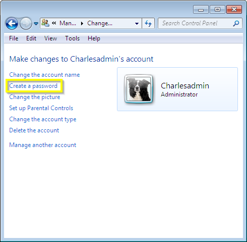

Enter the password twice, and do not enter a password hint.

.. figure:: pix/10-accounts/05-standard/25-set-password.png
   :align: center
   :alt: Change Charlesadmin password

Now the admin account should have a password:

.. figure:: pix/10-accounts/05-standard/30-has-password.png
   :align: center
   :alt: Charlesadmin has a password

Next, remove the administrator permissions from your daily-use account.
Click "Manage another account".

.. figure:: pix/10-accounts/05-standard/35-manage-another.png
   :align: center
   :alt: Manage another account

Then choose your old account:

.. figure:: pix/10-accounts/05-standard/40-remove-admin.png
   :align: center
   :alt: Change Charles account

Click "Change the account type":

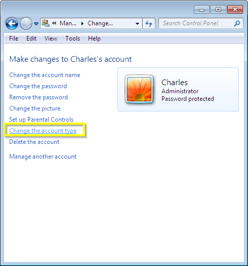

Next, make the account a "Standard user":

.. figure:: pix/10-accounts/05-standard/50-make-standard.png
   :align: center
   :alt: Make Charles a standard account

Then click "Change Account Type", and you are done.

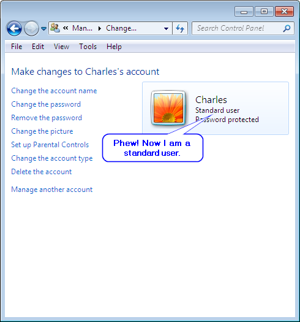

Changes will take effect once you log out and log back into your
computer.

Keep UAC enabled
~~~~~~~~~~~~~~~~

You will want to make sure that User Account Control is enabled properly
on your computer. To do this, click the Start Button, go to Control
Panel, and search for "UAC", then select "Change User Account Control
Settings":

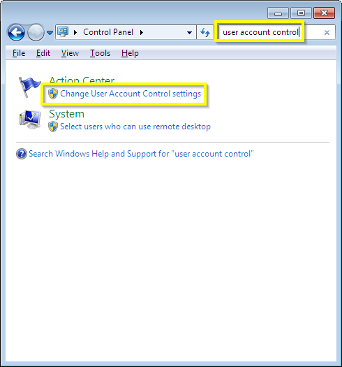

You will see a slider with four settings. Make sure the slider is set to
"Always Notify". Click OK and you are done.

.. figure:: pix/10-accounts/10-uac/10-uac-slider.png
   :align: center
   :alt: UAC slider: choose "Always Notify"

Do your backups
---------------

Backups do not prevent viruses, but they can make it easier to recover
if your computer is infected. Some viruses are very destructive, and
will encrypt or delete your files so you can no longer access them.
Having good backups prevents you from losing everything.

We will look at three different kinds of backups in this document:

-  System Restore and previous versions, which backs up recently changed
   files. This is easy to configure, costs no additional money, and
   makes it easy to recover older versions of your files. However,
   System Restore will not protect you against disasters like lightning
   strikes or your hard drive dying, and typically System Restore will
   not back up everything long term.

-  Windows Backup, which can put backups on a USB flash drive, a second
   hard drive on your computer, or a remote location. This takes a
   little work to configure, but once set up it will back up your files
   regularly. This system costs a little money because you have to
   purchase something to back your data onto. These backups will help
   against viruses and your primary hard drive dying, but are still
   vulnerable to lightning strikes or computer theft.

-  Remote backups, which put your backups on a hard drive far away.
   There are many remote backup solutions, but we will look at a service
   called Mozy, which is pretty easy to configure. Remote backups can
   protect you against computer theft and lightning strikes, but they
   have disadvantages as well: they will use up bandwidth on your
   internet connection, and you have to trust the remote location where
   your backups are being stored, because transferring your personal
   files over the internet makes it easier for others to see their
   content.

At the very least, we recommend enabling Previous Versions and Windows
Backup to a local drive. You can then evaluate whether you feel
comfortable storing backups to a remote service.

Your personal files are the most important things to back up, because in
general you can always re-download and reinstall programs and multimedia
files from the Internet. Most people care about backing up the following
things:

-  Their documents (which tend to be small and easy to back up)
-  Their pictures (which are bigger than documents, but can often fit on
   a single USB flash drive)
-  Their music and movies (which require lots of storage to back up)

Enable System Restore and Previous Versions
~~~~~~~~~~~~~~~~~~~~~~~~~~~~~~~~~~~~~~~~~~~

System Restore is usually enabled automatically, but you should check
that it is enabled and working. Start by clicking the Start menu, going
to Control Panel, and searching for "System Restore", then clicking
"System":

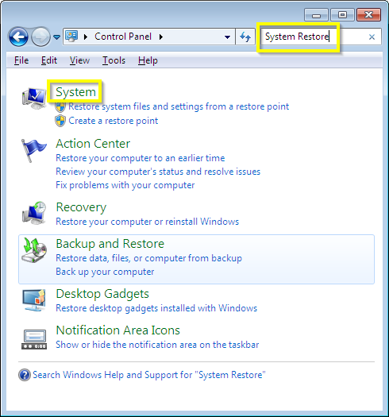

Next, click "System Protection"

.. figure:: pix/15-backups/05-sysrestore/05-system-protection.png
   :align: center
   :alt: Select System protection

Make sure that your hard drives (at least Drive C:) have protection set
to "On". If not, click "Configure" and select "Restore system settings
and previous versions of files"

.. figure:: pix/15-backups/05-sysrestore/10-drivec-enabled.png
   :align: center
   :alt: Check that Drive C is enabled

Once System Protection has been activated, you should be able to go to
individual files and see previous versions of the files that have been
taken. This process usually takes a couple of days to start, but we can
check that this functionality works by initiating a restore point. Start
by going to My Documents and making a document file by clicking the
"File" menu:

.. figure:: pix/15-backups/05-sysrestore/15-mydocs.png
   :align: center
   :alt: Click File menu

And then creating a new Text Document:

.. figure:: pix/15-backups/05-sysrestore/20-new-txt.png
   :align: center
   :alt: Create new Text Document

Give the document a name:

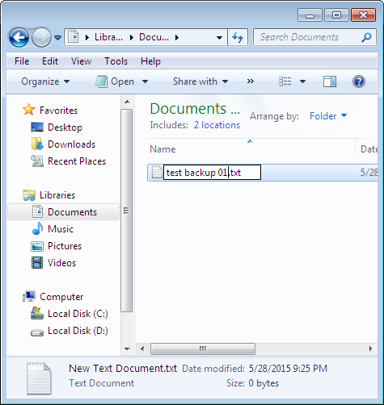

Double click the document to open it, and then put some text in the
document.

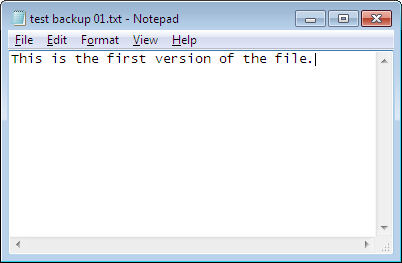

Save the document. Now go to the System Restore tab above and click
"Create":

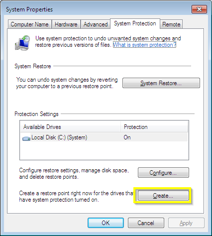

Give the restore point a name (it doesn't matter what):

.. figure:: pix/15-backups/05-sysrestore/40-name-restorepoint.png
   :align: center
   :alt: Name the restore point

Wait a while for the system restore to complete. You should see that the
restore point was created successfully:

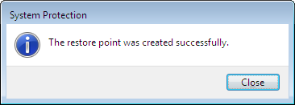

Next, re-edit your document and add some text, then save the changed
document.

.. figure:: pix/15-backups/05-sysrestore/50-notepad02.png
   :align: center
   :alt: Changing the document

Now go back to your document, right-click it, and select "Properties":

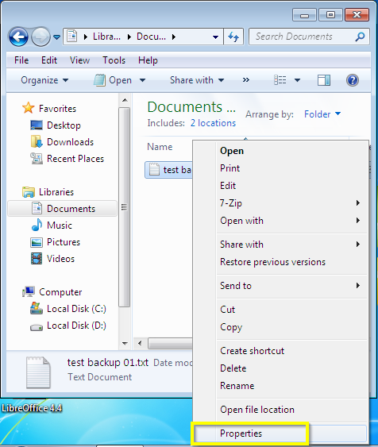

Click the "Previous Versions" tab.

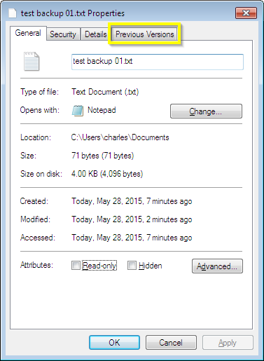

You should see there is a previous version of the document available.
You can then restore this previous version. To avoid overwriting the
current version, choose to make a "Copy" of the old version:

.. figure:: pix/15-backups/05-sysrestore/65-restore-prev-version.png
   :align: center
   :alt: Restore to a copy

You are best off making a new destination for the restored file. In this
case we are making a "test restore" folder:

.. figure:: pix/15-backups/05-sysrestore/70-copy-location.png
   :align: center
   :alt: Make test restore folder

If you navigate to that folder you should see the old version of your
file.

[SCREENSHOTS?]

Local backups to a USB flash drive
~~~~~~~~~~~~~~~~~~~~~~~~~~~~~~~~~~

Windows Backup is built into Windows 7. You can use it in a variety of
ways, but we will focus on sending backups to a USB flash drive that is
permanently attached to your computer.

The first step is to purchase a new USB flash drive, and put it in your
computer. This drive will be used to store the backups. Any drive you
can purchase for $10 or more should have plenty of space to store your
documents and some of your pictures. The flash drive should be empty;
Windows Backup will be unhappy otherwise.

To start Windows Backup, click the Start button, go to Control Panel,
and search for "backup". Click "Back up your computer":

.. figure:: pix/15-backups/10-usb/00-controlpanel-backup.png
   :align: center
   :alt: Back up your computer

Click "Set up Backup"

.. figure:: pix/15-backups/10-usb/05-set-up-backup.png
   :align: center
   :alt: Set up Backup

Now choose the USB flash drive as a backup location (in this picture it
is labelled "FLASHDRIVE", but it may labelled as "Removable Drive" or
something else):

.. figure:: pix/15-backups/10-usb/10-choose-flash-drive.png
   :align: center
   :alt: Select USB flash drive

If you are backing up to a large device (such as a removable hard drive)
then you can let Windows choose what to back up. Otherwise select "Let
me choose"

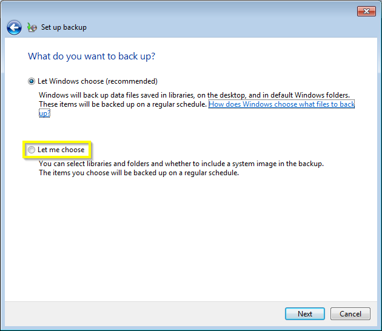

Now double click "All users". This should bring up a selection list.

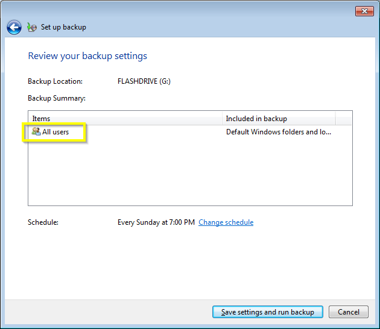

The most important things to back up are your "Libraries". If you are
backing up to a USB flash drive, then you want to back up at least the
"Documents" and "Pictures" libraries, assuming that is where you have
stored your documents and pictures. If you have stored large files
(movies, music) in your Documents folder then you will want to refine
the selections further.

.. figure:: pix/15-backups/10-usb/25-make-selections.png
   :align: center
   :alt: Unselecting Music and Videos

If you are backing up to a small device, you can unselect the Music and
Videos libraries:

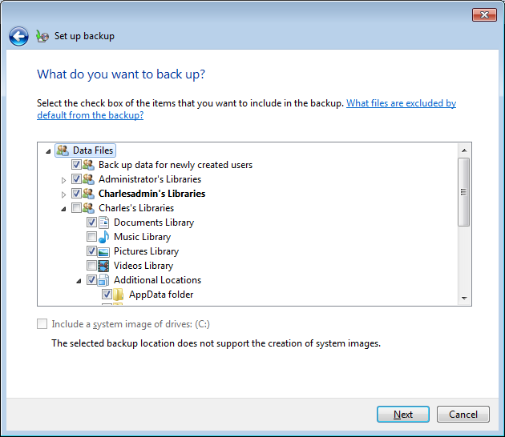

In general backing up more information is better than backing up less,
but you also do not want to run out of space on your backup device. When
you have made your selections, click "Next".

On the next screen you can edit the backup schedule. Ideally you would
choose a schedule when your computer will already be turned on. Click
"Change schedule" to choose an appropriate time. You should run the
backup weekly or daily.

.. figure:: pix/15-backups/10-usb/40-schedule-screen.png
   :align: center
   :alt: Set backup schedule

Click "Save settings and run backup".

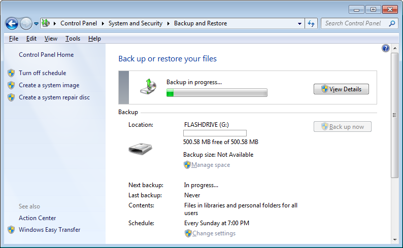

If you are lucky then the backup will complete successfully:

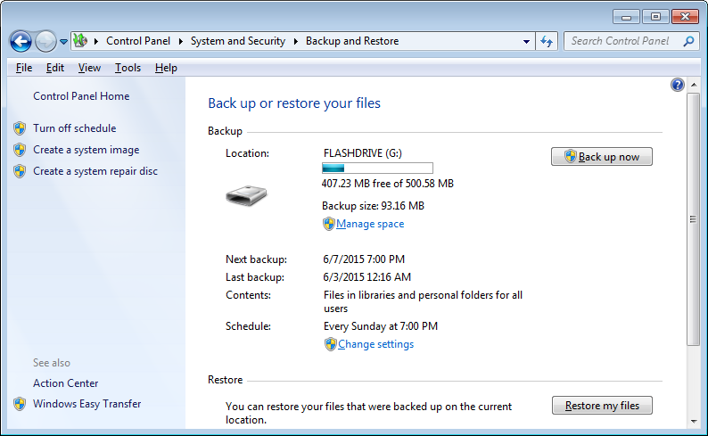

If your computer is off when the backup is scheduled, then the backup
should run the next time you turn on your computer. Note that you will
have to leave your USB drive plugged into your computer *permanently* in
order for this backup scheme to work.

Other ways to use Windows Backup
^^^^^^^^^^^^^^^^^^^^^^^^^^^^^^^^

In addition to backing up files onto a USB drive, you can also use
Windows Backup to:

-  Back up files to an external hard drive.
-  Back up files to a second internal hard drive you install in your
   computer.
-  Back up files to a Windows share on a different computer. This might
   be possible if you have a second computer or a media server at home.

Contact Computer Recycling if you are interested in exploring these
possibilities.

Remote backups using MozyHome
~~~~~~~~~~~~~~~~~~~~~~~~~~~~~

There are many remote backup services. In this handout we will set up
one called MozyHome. This company allows you to back up 2GB of files on
their servers for free, which should be sufficient to back up important
documents. It is also installable using Ninite.

Mozy also offers paid plans if you would like to store more data on
their servers.

Note that as soon as you store your backups on somebody else's servers,
you are trusting that this company will not peek at your data. Many
backup companies promise that they do not look at your data, but as an
end user you have no good way to confirm this.

Note that Mozy (like other companies offering "freemium" services) makes
it tricky to install their free offerings. Their goal is to direct you
towards their paid products. Thus you have to jump through some hoops to
install their product. (There is nothing preventing you from paying them
for their service, of course!)

To get started, you first need to create a free MozyHome account. To do
this, visit https://mozy.com/free :

.. figure:: pix/15-backups/20-mozy/00-mozyfree-webpage.png
   :align: center
   :alt: Mozy Free homepage

Note that Mozy will make it difficult to create a free account unless
you use the https://mozy.com/free page. Clicking the "Sign up" link will
direct you to create a paid account.

You are first prompted to enter your country of residence:

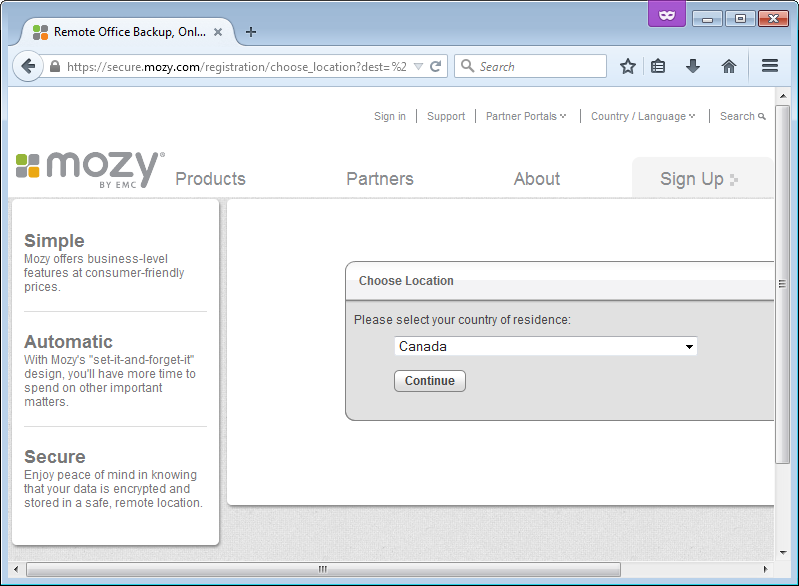

Enter your email address and choose a password.

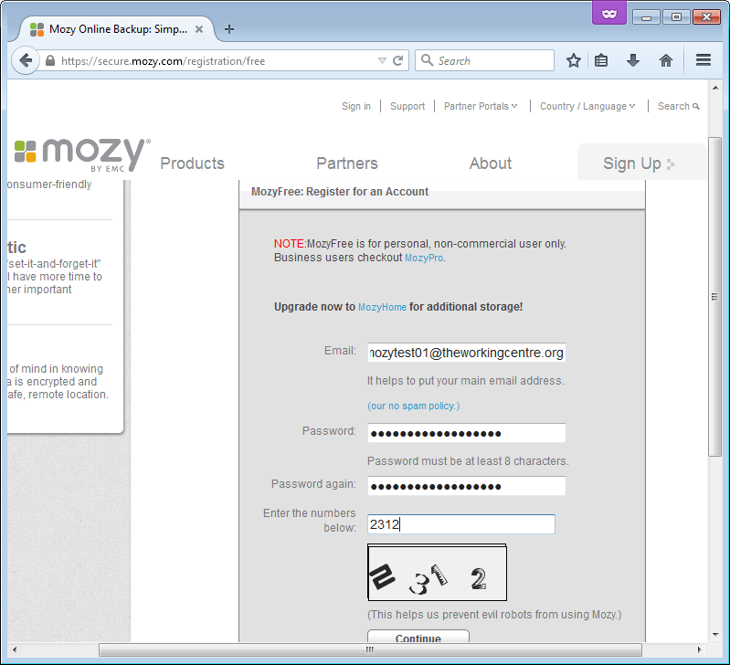

You should then see a prompt to check your email:

.. figure:: pix/15-backups/20-mozy/09-post-signup.png
   :align: center
   :alt: Check your email

When you do so, you should see an activation link from Mozy. Often you
want to be careful about clicking links in email (see the **Be careful
about links in email** section below) but in this case you are expecting
a registration email:

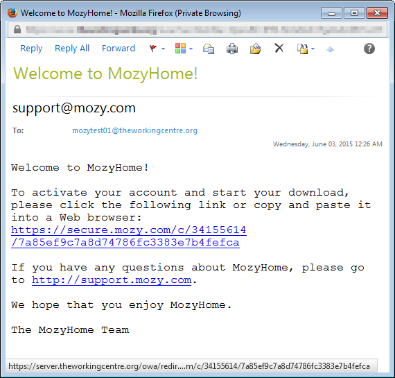

After clicking the link you should see a confirmation that your account
has been created. You do not need to do much with this account, but you
may want to look in the "Manage Account" section and unsubscribe
yourself from Mozy emails.

On this page you will also see a link that you can use to download the
Mozy client software. You can click that link and install Mozy if you
want, but there are a bunch of steps and you have to be careful about
not choosing a Mozy paid plan by accident. Instead, we recommend going
to Ninite (http://ninite.com) and using that to install the Mozy client
instead:

.. figure:: pix/15-backups/20-mozy/17-ninite-mozy.png
   :align: center
   :alt: Install Mozy via Ninite

For more detailed instructions on using Ninite to install software, see
the **Use Ninite to install common software** section below.

Once you have installed the software, it is time to set up a backup. Log
in with the email account and password you created:

.. figure:: pix/15-backups/20-mozy/33-sign-in.png
   :align: center
   :alt: Sign into MozyHome client

The next screen lists some files Mozy is offering to back up, and states
that Mozy will use "standard encryption" to back up your files. You can
use standard encryption if you want, but that means Mozy (and
potentially other entities on the Internet, such as government spy
agencies) can see your documents more easily.

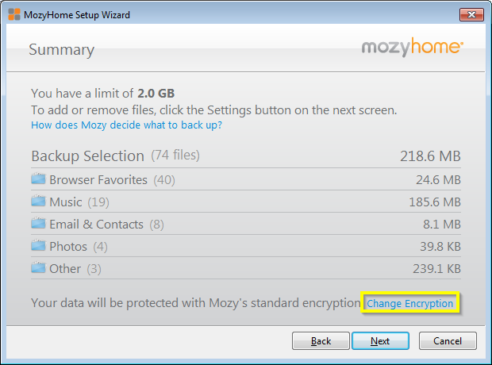

If you click "Change encryption" then Mozy will give you the option of
choosing your own password to protect your backups. If you use your own
password then Mozy promises that they will not be able to see the
contents of your backups, even under force of law. It also means that
you MUST put this password in a safe place. Putting the password on a
computer file is not sufficient, because your hard drive may be dead (or
your computer stolen!) when it is time to restore your backups.
According to Mozy, without this password you will not be able to restore
your backups when you need them.

If you value convenience over privacy, then you can leave the encryption
as-is. Otherwise, click "Change Encryption". You will see a warning
dialog:

.. figure:: pix/15-backups/20-mozy/39-confirm-key-management.png
   :align: center
   :alt: Confirm key management

You will be prompted to choose a personal key (we have obscured the key
we typed, and you should keep your key a secret too!). The "Key" is just
a password you choose. You want to choose a strong password, and you
want to record it someplace where you can get it after your computer has
broken.

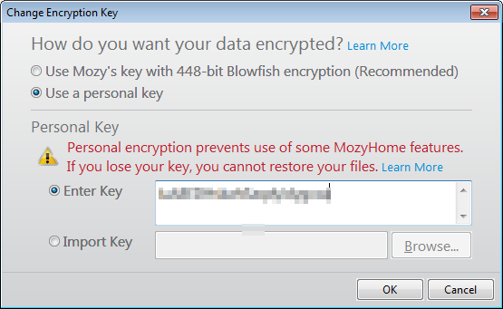

You will have the option to save your personal key (password) to a file.

.. figure:: pix/15-backups/20-mozy/36-save-key.png
   :align: center
   :alt: Save Key

It might be a good idea to store this key on a secure USB flash drive or
in a password manager like KeepPass.

Next Mozy will tell you that setup is complete, but you may want to
click the Settings button to change what is being backed up:

.. figure:: pix/15-backups/20-mozy/45-mozy-status.png
   :align: center
   :alt: Mozy Status

Go to "Backup Sets", and unselect "Music" and "Videos" if they are
large:

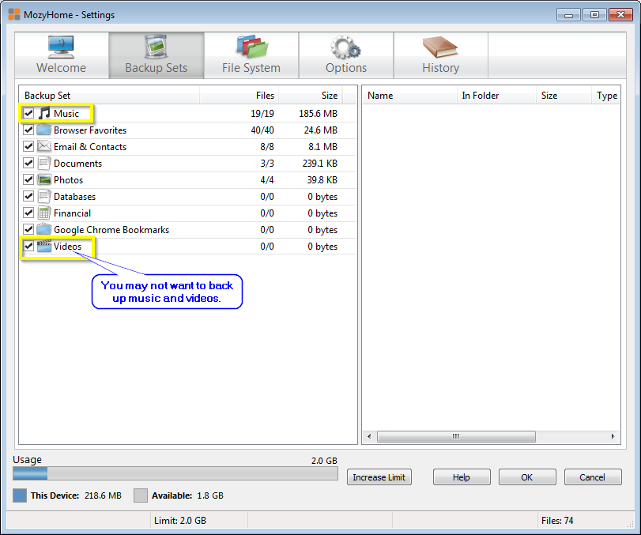

You will then have the option of choosing what files to back up. You
probably want to back up your Internet Favorites and Documents first. If
you have space, you can then back up photos. You probably will not have
enough storage space to back up music or video files to Mozy.

Now you can let the Mozy service do its first backup by clicking "Start
Backup" on the status screen:

.. figure:: pix/15-backups/20-mozy/45-mozy-status.png
   :align: center
   :alt: Mozy status screen

By default Mozy will back up your files twice a day. You can change this
frequency. You will also want to be careful about how much bandwidth the
service is using to back up your files.

There is a Mozy icon in your system tray in the bottom-right corner of
your screen. You can click it to see your backup status or change
settings:

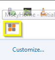

You can also open the Mozy client by clicking the Start menu and
searching for "mozy"

.. figure:: pix/15-backups/20-mozy/51-mozyhome-settings.png
   :align: center
   :alt: Start menu search for Mozy

To restore files from Mozy, open the program and then browse to the
"Restore" tab:

.. figure:: pix/15-backups/20-mozy/54-mozy-restoretab.png
   :align: center
   :alt: Mozy Restore tab

Mozy will keep up to thirty days worth of changes to your files, so if
you accidentally delete a file (or it is infected with a virus like
Cryptolocker) then you can restore it.

.. figure:: pix/15-backups/20-mozy/57-restore-dialog.png
   :align: center
   :alt: Mozy restore files

You probably do not want to overwrite your old files. Restore your files
to a different location, and then get rid of the damaged files once you
are sure the restored ones are adequate.

Choose the files you want to restore, select "Rename file if file
exists", and then choose to "Restore Files"

For more information on using Mozy, use the help option in the program:

.. figure:: pix/15-backups/20-mozy/60-helplinks.png
   :align: center
   :alt: Mozy help options

Be careful about downloads
--------------------------

One of the most common ways viruses get on your computer is through
surfing the web and downloading programs.

Note that the advice in this section build upon previous sections. Using
out of date software and using administrator accounts for daily tasks
makes it easier for viruses to download themselves onto your computer.

There are a lot of sketchy, misleading software sites on the Internet.
Some of them are outright scams: the software they offer comes preloaded
with viruses and other malware. Other sites make money by posting
misleading advertisements intended to make you download stuff you really
don't want on your computer.

Even legitimate software products like Oracle (which makes Java) and
Adobe (which make Flash player) bundle nasty toolbars with their
plugins.

In this section we will cover some good practices for avoiding these
nasties.

Use Ninite for common downloads
~~~~~~~~~~~~~~~~~~~~~~~~~~~~~~~

One of the best resources for installing clean software is Ninite.
Previously we discussed re-running Ninite installers to keep your
existing software up to date, but you can also use Ninite to install new
software. Ninite does not include every piece of software you might ever
want to download, but it does include a selection of the most popular
programs and plugins. It also promises to keep its downloads clean of
toolbars and other unwanted bundles (and in our experience they have
kept this promise so far).

To install new software go to http://ninite.com. Scroll down to see the
list of programs:

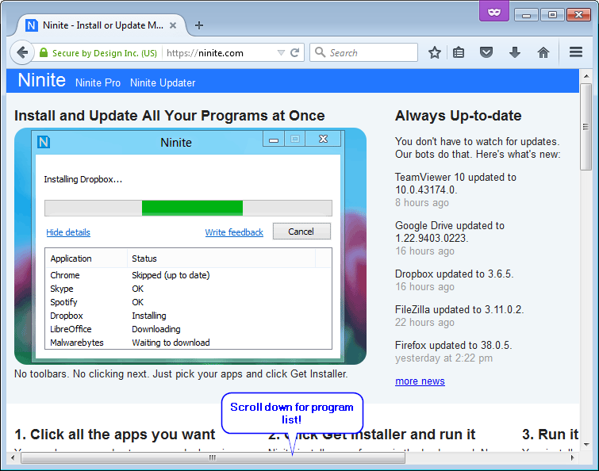

Select the set of programs you would like to install. If you already
have a Ninite installer, you can choose your new programs and also the
ones from your own installer, or you can just select new programs.

When you have chosen the programs you want, click "Get Installer".

.. figure:: pix/20-downloads/05-ninite/05-select-mozy-essentials.png
   :align: center
   :alt: Select programs

The installer should download to your computer.

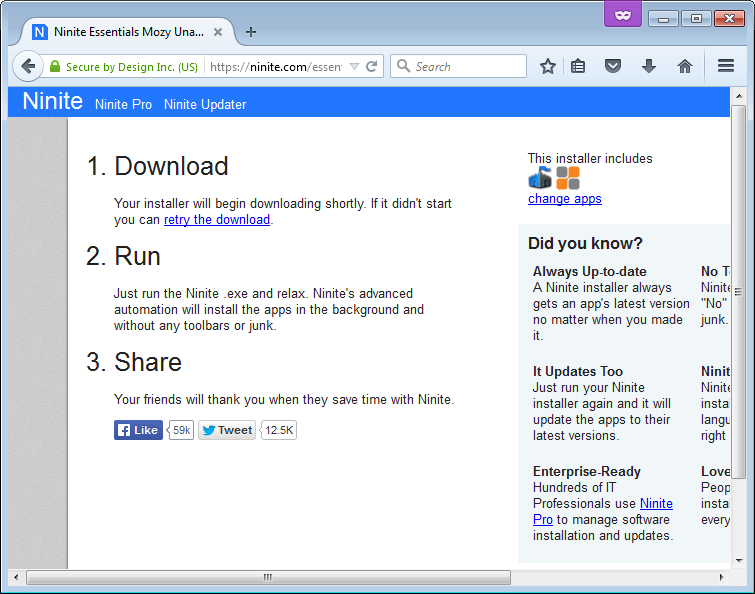

.. figure:: pix/20-downloads/05-ninite/10-download-dialog.png
   :align: center
   :alt: Save installer

Save this installer in a place where you can find it again. You can use
it to keep your software up to date. An easy way to find the installer
is to open the download location:

.. figure:: pix/20-downloads/05-ninite/15-open-download-folder.png
   :align: center
   :alt: Open download dialog

Finally, right-click the installer and choose "Run as Administrator" to
install your programs.

.. figure:: pix/20-downloads/05-ninite/20-run-as-admin.png
   :align: center
   :alt: Run as administrator

You will be prompted for an administrator password, and then you will
see the program downloading and installing files:

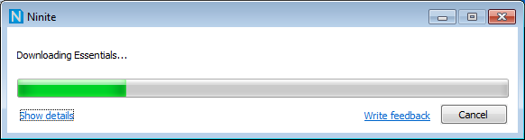

Click the "Show details" link to get more information about Ninite's
progress:

.. figure:: pix/20-downloads/05-ninite/30-detailed-interface.png
   :align: center
   :alt: Download: detailed interface

Not every program offered by Ninite is perfect, but it is our first
choice for recommended downloads (which is why we chose to recommend
MozyHome as our remote backup program).

To update your programs, simply run the installer as administrator
again. You do not need to go back to the Ninite homepage to re-download
an installer.

Install an ad blocker
~~~~~~~~~~~~~~~~~~~~~

Many viruses get on your computer when you click the wrong window on
your screen, or click a misleading advertisement that downloads unwanted
software to your computer. For this section, we'll use the example of
downloading a software program from a popular download site. This site
contains many misleading advertisements intended to trick you into
downloading things you do not want. (We have documented several other
examples of misleading downloads [WHERE?])

.. figure:: pix/20-downloads/10-adblock/03-majorgeeks.png
   :align: center
   :alt: Misleading advertisements

If you use an ad-blocking plugin for your web browser, many of these
malicious advertisements will not show up, making your website safer. We
will demonstrate how to install the ad blocker AdBlockPlus for Firefox.

To start, run Firefox and navigate to Ad-Ons:

.. figure:: pix/20-downloads/10-adblock/05-add-ons-link.png
   :align: center
   :alt: Navigate to add-ons link

In the search bar, type "AdBlock Plus"

.. figure:: pix/20-downloads/10-adblock/10-adblock-search.png
   :align: center
   :alt: Search for Adblock Plus

Choose the AdBlock Plus plugin and choose to install it. Be careful that
you choose the right product -- as you can see there are many different
adblock plugins. Most of them are probably okay, but there may be some
that are themselves malicious.

Once you have chosen to install the plugin, Firefox should then indicate
that the plugin is installed.

.. figure:: pix/20-downloads/10-adblock/15-installed.png
   :align: center
   :alt: Adblock Plus installed

Ironically, the Adblock Plus website will then pop up in a browser
window:

.. figure:: pix/20-downloads/10-adblock/20-abp-popup.png
   :align: center
   :alt: Adblock Plus website

Now when you navigate to websites in Firefox, AdBlock Plus will block
obnoxious ads.

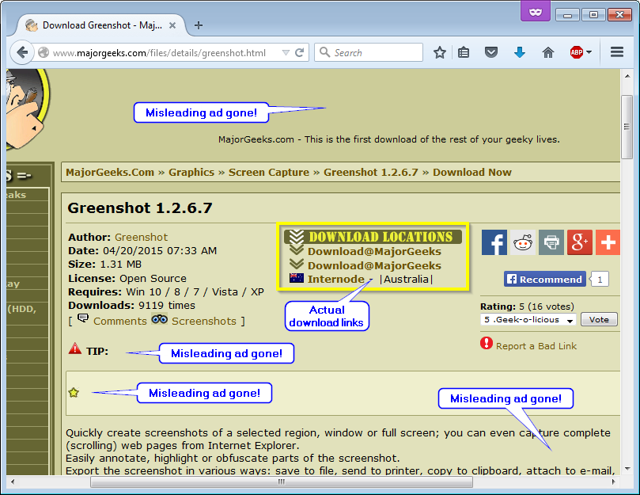

However, it will not block all advertisements. By default, it will
continue to display "non-obtrusive" ads:

.. figure:: pix/20-downloads/10-adblock/30-unobtrusive-ad.png
   :align: center
   :alt: Supposedly unobtrusive advertisement

This brings up an important ethical issue about ad-blocking software.
Using an ad blocker is a good practice to avoid scary popups and
inadvertant downloads. However, many internet sites get much of their
revenue by displaying advertisements, and when you use an ad blocker you
deprive those websites of their revenue stream. That means those
websites could go out of business, depriving you of future content.

Thus, it might be advisable to allow websites that you like and trust to
display advertisements to you. To do this, you "whitelist" the website.
To do this, first navigate to the website.

.. figure:: pix/20-downloads/10-adblock/35-mefi-blocked.png
   :align: center
   :alt: Website worth supporting

Choose the AdBlock Plus icon in the corner, and select "disable" for
this website:

.. figure:: pix/20-downloads/10-adblock/40-unblock-dialog.png
   :align: center
   :alt: Unblock dialog box

Then the website will be able to display advertisements to you.

.. figure:: pix/20-downloads/10-adblock/45-mefi-ads-allowed.png
   :align: center
   :alt: The website shows ads now

If you allow ads on trustworthy websites you enjoy, then it is less
likely that those websites will go out of business.

Unfortunately ethical issues around ad-blocking get even more
complicated ethically. Advertisements on the Internet are also tracking
mechanisms: they track where you go and what you do on the Internet.
Some people are okay with this. Other feel it is intrusive, and so use
ad blockers to block as many ads as they can. As if that is not enough,
there is not guarantee that the ad-blocking software itself is
trustworthy! There are no easy answers to this quandry; you will have to
decide your own values and comfort level and act accordingly.

Be careful about email attachments
~~~~~~~~~~~~~~~~~~~~~~~~~~~~~~~~~~

Another common way for viruses to get on your computer is if you
mistakenly open an email attachment that contains a virus. Email
providers are getting better about screening out virus-laden attachments
from the email your receive, but infected attachments are still common.

Here are some rules of thumb to follow:

If you are not expecting an attachment, then do not open it. For
example, the following email from a stranger is suspect:

[SCREENSHOT]

Even if you get an email from a friend or relative you might be in
trouble. Be particularly wary if the email has strange wording or does
not sound as if it came from the recipient in question, or if the email
is asking you for money. In such situations the email account of your
friend or relative may have been hacked, and is sending out virus-laden
emails to everybody in their contact list:

[SCREENSHOT]

You should almost never open attachments that have two filename
extensions, such as .zip.exe :

[SCREENSHOT]

Such attachments are named to confuse you, and very often contain
viruses.

If you are unsure about whether a particular attachment is safe to open
or not, you should contact the sender in question -- preferably over the
phone or an instant messenger program, not email! Many antivirus
programs will also attempt to scan the attachment for viruses, but this
is not always foolproof.

Be careful about links in email
~~~~~~~~~~~~~~~~~~~~~~~~~~~~~~~

Distinguishing legitimate email from scam emails takes a lot of
practice. Often you will see plausible-looking emails containing links
for you to click. Here is an example:

.. figure:: pix/20-downloads/20-emaillinks/10-fake-url.png
   :align: center
   :alt: Fake Paypal Email

There are many clues that suggest this email is fake: - misspelled words
- pressure tactics to get you to click the link - an address of
"hostme@interac.com" instead of an address from paypal.com - the
destination of the link going to a different web URL (you can see this
by hovering over the "Confirm My Address" link)

Even if you do not catch any of these clues, you still should not click
links in emails you do not expect. If you are worried that the warnings
might be legitimate, go to the web service directly (in this case, go to
the PayPal website by searching for "paypal" in a search engine) and
then log in there. If the warning is legitimate you will probably be
able to confirm this after logging in.

If you don't have a PayPal account at all, then you can be sure that
this message is fake.

If the link is to a website then make sure the displayed link text
matches the link destination.

.. figure:: pix/20-downloads/20-emaillinks/05-easy-spam.png
   :align: center
   :alt: Fake WhatsApp Email

This message wants to fool you into thinking that somebody sent you a
link to a video via WhatsApp (a social networking platform). If you
hover over the link, however, it goes to "creamnetwork.com", which is
probably a hacked website. Sometimes the misleading links can be pretty
close to the real one. For example, instead of "whatsapp.com" a link
might be spoofed as "whatsapp.someotherwebsite.com".

It takes a fair amount of practice to learn how to distinguish fake
emails from real ones. And the problem is not limited to email! Spammers
have invaded Facebook, Twitter, blogs, and many other platforms, and all
of these platforms contain links intended to get you in trouble. But
even if you are not a computer genius, there are some rules of thumb
that can help keep you safe:

-  If you are not expecting the email in question, **don't click the
   link**.
-  If you get a link to a website in your email, **go to the website
   directly**, not by clicking the link.
-  If you get an email from a friend or family member that seems fishy,
   **don't follow instructions**. Spammers routinely break into email
   accounts and send spam emails to everybody in the victim's contact
   list.
-  If you do click a link and it takes you to a login page, **do not log
   in, and close your browser window**. Often such login pages are fake,
   intended to get your username and password.
-  If you click a link and it takes you to weird site, **close the
   window**.
-  If you click a link and it downloads a file to your computer, **do
   not open the file**. It could very easily contain malware that will
   infect your computer.

Be careful where you download software
~~~~~~~~~~~~~~~~~~~~~~~~~~~~~~~~~~~~~~

There are many places to get software on the Internet. Some websites
(such as download.com, MajorGeeks, and SoftPedia) serve as "software
mirrors", providing (possibly modified) copies of popular software
downloads. These websites show up high in web search results, so it is
easy to visit them when you are looking for software.

Many mirror websites use ads that try to mislead you into clicking links
for things you do not want. In the section **Install an Ad-blocker**
[CHECK] above we saw one example of this. Here is another:

.. figure:: pix/20-downloads/25-mirrorsites/10-download-cnet.png
   :align: center
   :alt: Misleading links on CNet

Other websites bundle toolbars and other undesirable software along with
the download you want. Often there is legalese on the site claiming that
you can opt-out of the extra software, but you have to look carefully:

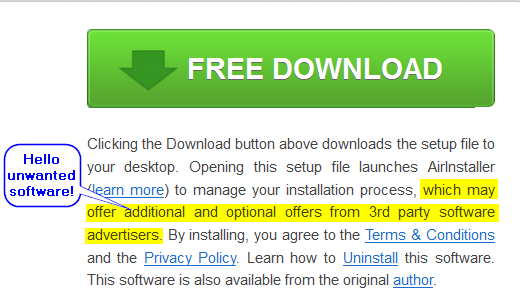

In addition, some mirror websites provide software that is out of date,
but that is a lesser concern.

Not all mirror websites are equally bad, but it is easy to be misled
when using them. Overall you are best avoiding mirror sites entirely. If
the software is available on Ninite, use that service instead.
Otherwise, look for the official software website:

.. figure:: pix/20-downloads/25-mirrorsites/20-google-search.png
   :align: center
   :alt: Official site in download results

Unfortunately, you have to be careful even in this case, because
sometimes official downloads are bundled with toolbars and other junk.
The Greenshot software in this example does not, but other software
downloads do.

For example, this Java installer changes your homepage and search
provider, unless you remember to uncheck the box below:

.. figure:: pix/20-downloads/25-mirrorsites/25-java-yahoo.png
   :align: center
   :alt: Yahoo search bundled with Java

This download of Adobe Flash Player wants to install a McAfee plugin
along with it:

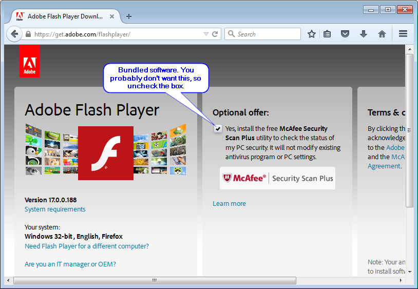

And this download of PDFCreator wants to install an "Ad-Aware Web
Companion", as well as changing your search provider to Bing:

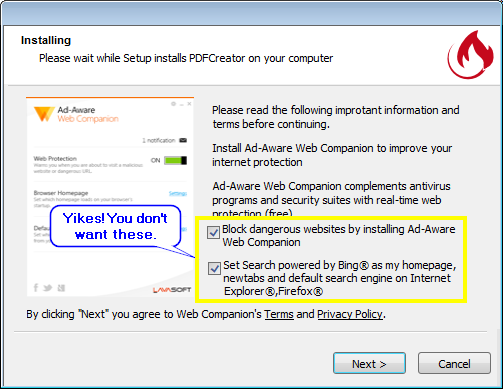

You almost always want to avoid installing this extra software with your
downloads.

Astute readers might notice that we recommend https://ninite.com, which
is also a sort of mirror website. As of this writing, we believe Ninite
does not engage in these kinds of questionable practices.

Once in a while you cannot find legitimate downloads on official sites.
In this case you may want to seek help. People at Computer Recycling can
help you locate legitimate downloads, or you may have a friend who is
both knowledgable about computers and whose judgement you trust.

Avoid toolbars
~~~~~~~~~~~~~~

Many programs come bundled with web browsing toolbars, such as the
Google Toolbar, the Ask Toolbar, the Bing Bar, or Conduit Search. For
the most part, these are bad news. At the very least they track your
movements on the Internet and report your activities to their central
servers. In worse cases they can infect your computer with malicious
software that is very difficult to remove.

.. figure:: pix/20-downloads/30-toolbars/10-toolbars-yuck.png
   :align: center
   :alt: Google Bar and Bing Bar

You do not need toolbars to surf the web effectively. You can use
favorites or bookmarks to visit websites you care about easily. You can
also change your preferred search engine easily. Contact Computer
Recycling if you would like help in doing these things.

Avoid pirated software and key generators
~~~~~~~~~~~~~~~~~~~~~~~~~~~~~~~~~~~~~~~~~

Some software is expensive. It is very tempting to download
illegally-distributed ("pirated") copies of this software from so-called
"warez" sites or torrents. Sometimes you might be tempted to download
key generating software that will activate demo versions of software
without you having to register or pay for the software.

As a general rule, this is a bad idea! Often the people who are making
illegal software available for download have ulterior motives. Many of
them want to make money, and one way to do so is by including viruses
along with the illegal downloads. People who have no moral compunctions
about redistributing other company's software often have no moral
compunctions about infecting your computer with viruses either.

Often there are free and legal alternatives to the software you are
looking for. These free alternatives may not be as sophisticated as the
commercial software you are tempted to pirate, but often they will get
the job done. One good resource for finding such software is the
Alternatives To site: http://alternativeto.net/

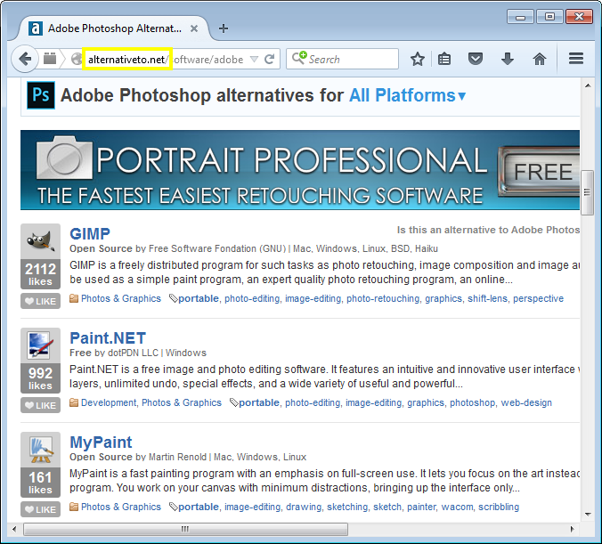

You can also ask knowledgable friends or volunteers at Computer
Recycling for suggestions.

When deciding upon alternative software, you want to make good choices.
Poorly-written or infrequently-updated software can also make your
computer more vulnerable to viruses. It can be helpful to ask yourself a
few questions:

-  Is the software regularly updated for security issues?
-  Do the software developers take security issues seriously?
-  Is there a sizable community of people who use the software and
   report problems?
-  Does the software work well? Does it do most of what you need?

Keep your antivirus up to date
------------------------------

Antiviruses can help stop some virus and malware infections from getting
on your computer, but they do not catch everything. Practicing some of
the techniques listed above can help prevent malicious software from
being downloaded to your computer in the first place. In this sense,
antiviruses are a last defense.

There are lots of antivirus products on the market. Some of them are
free for home users, and others cost money. They do vary in quality.

If you are looking for a free antivirus, Microsoft Security Essentials
is a reasonable choice. It is available from Ninite, is legal for home
users to use, offers okay protection from viruses, and does not nag you
to upgrade to a paid product:

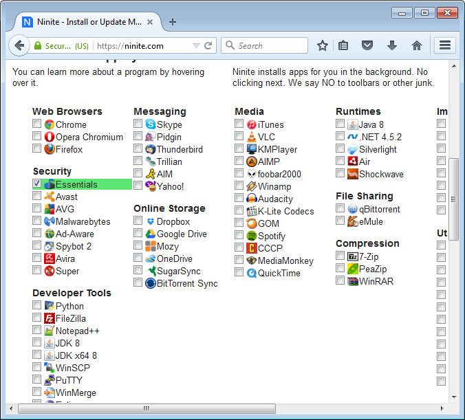

There are several other antiviruses available from Ninite: Avira, AVG,
and Avast. (And others?) Many of these products require registration to
work, and they will nag you to purchase their paid offerings, but they
might be sensible choices as well:

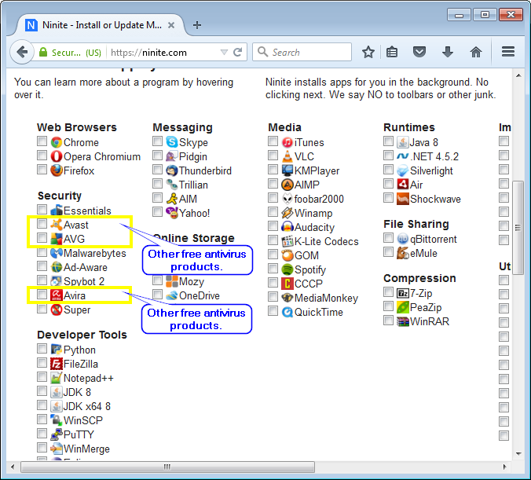

You might also choose to pay for an antivirus product, or you may
receive one in some other way (for example, you may pay for one via your
Internet Service Provider).

In general you only want to run one antivirus product at a time, because
two different antivirus products can fight with each other, making your
computer very slow. Having said that, there are some antimalware tools
that can be used to scan your computer manually. One product we like is
called MalwareBytes Antimalware:

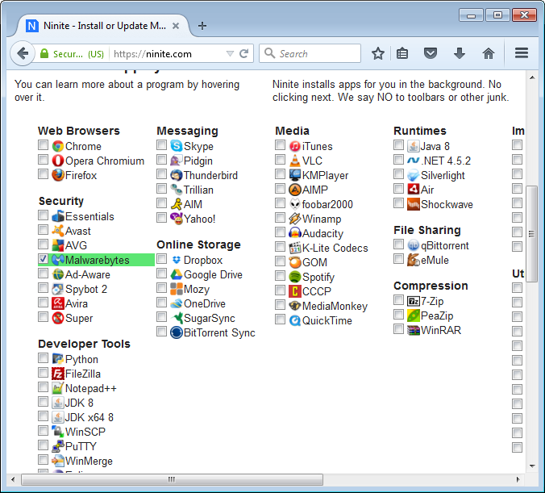

MalwareBytes does not include a realtime scanner, so it must be run
manually. This product can be good to run on a semi-regular basis (say
once a month) or if you suspect you may have been infected with
something.

Develop a support network
-------------------------

Computers and the Internet are confusing. As illustrated in previous
sections, sometimes things on the Internet are deliberately misleading.
It can be very helpful to have a support network of people you can turn
to for help when computers are confusing you. There are many resources
available locally:

-  The `Kitchener Public Library <http://kpl.org>`_ holds drop-in
   sessions for computer support Wednesday evenings.
-  The `Bits and Bytes computer club <http://bitsbytes.ca>`_ offers
   meetings and workshops for older computer users. They meet several
   times a month.
-  The Waterloo Public Library offers a `tech
   connect <http://www.wpl.ca/services/tech-connect>`_ service where
   volunteers can help answer your questions.
-  Volunteers at Computer Recycling can help answer some of your
   questions.
-  There are computer support volunteers in the public labs of The
   Working Centre who can help answer some questions as well.

In addition, you might find some friends or family members who can help
you. This can be difficult, however, because people who are very
knowledgable about computers do not always want to help you, and many
people who think they know a lot about computers actually don't. If you
are considering finding a computer buddy among your friends and family,
ask the following questions:

-  Is this person willing to help me? Does this person have the energy
   and time to do so, or would I be imposing myself?
-  Do I trust this person's judgement? Some people who know a lot about
   computers take unnecessary risks that can jeopardize your computer
   safety.
-  Does this person make me feel stupid when I talk with them about
   computer stuff? If so, that is a bad sign. You want to find somebody
   who will be patient with you, and who can explain computer concepts
   to you at a level you can understand.
-  How can I compensate and appreciate this person for their time and
   effort?

If you find a trustworthy computer buddy, you are very fortunate, and
you should be careful not to abuse this relationship by being overly
demanding. Asking these people for advice is usually quick; asking them
to fix your computer repeatedly often takes a lot of their time, and you
should not expect them to do this (especially if they are helping you
for free).

Other Strategies to Protect Yourself
------------------------------------

In this document we have covered some easy, effective measures to
protect yourself from viruses and other malware. There are lots of other
things you can do, but often they take more patience and learning. In
this section we will briefly mention some of them. If you are interested
in pursuing them further, you can speak to the volunteers at Computer
Recycling. [CHECK]

Restrict Javascript
~~~~~~~~~~~~~~~~~~~

Javascript is a programming language that is used extensively by
websites. Javascript is also used by people distributing viruses, so
blocking the use of Javascript in your web browser can go a long way to
protecting your computer.

One way to restrict the use of Javascript on your computer is via the
NoScript Firefox extension. This will allow you to selectively enable
and disable Javascript for particular websites.

.. figure:: pix/35-other/05-noscript/10-noscript-install.png
   :align: center
   :alt: NoScript extension on Firefox

Unfortunately, without Javascript many websites become unusable, so you
will have to spend time training the NoScript extension to allow
Javascript on websites you trust.

Be careful about wireless access
~~~~~~~~~~~~~~~~~~~~~~~~~~~~~~~~

When accessing the Internet using a public wireless connection such as a
coffee shop or the library, Windows will ask you whether the connection
in question should be "Work", "Home", or "Public". For these public
locations, you should choose "Public".

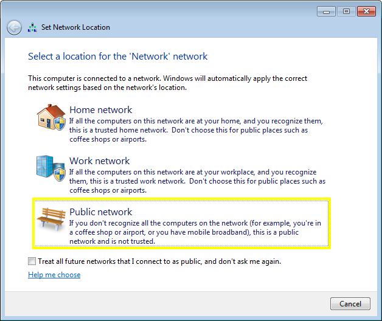

Use a password manager
~~~~~~~~~~~~~~~~~~~~~~

A password manager will not protect you from viruses directly, but it
will help you avoid using the same password for all of your services.
That way, if one of your online accounts gets compromised, the people
who made the virus will not get access to all of your other accounts as
well.

One password manager available on Ninite is KeepPass:

.. figure:: pix/35-other/15-password-manager/10-ninite-keeppass.png
   :align: center
   :alt: KeepPass on Ninite

This password manager makes you choose one "master password", which
should be long but typeable. Then you can generate completely different,
completely random passwords for all of the other services you use.

Consider virtualization
~~~~~~~~~~~~~~~~~~~~~~~

Virtualization is kind of weird: it consists of software that emulates a
second computer on your computer. You can then install a second
operating system (called a "guest") on this emulated computer. This
allows you to do things like install a running copy of Linux on your
Windows computer, or install Windows inside Windows.

In terms of avoiding viruses, this can be helpful in two ways. Firstly,
this allows you to **sandbox** installations of troublesome software, so
that they cannot interfere with the rest of your programs. Secondly,
virtualization software provides **snapshot** capabilities that allow
you to roll back unwanted changes to your virtualized computer.

One commonly-used virtualization product is Virtualbox:

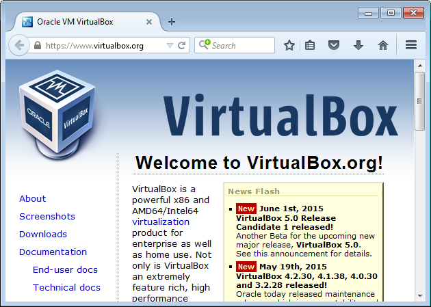

Unfortunately VirtualBox is not available on Ninite, so you have to
install the product from its homepage (http://virtualbox.org).

What are Viruses and Malware?
-----------------------------

Using the term "computer virus" is a little misleading -- there are many
kinds of **malware** you want to avoid, and technically not all of them
are computer viruses. Some types of malware you might hear about
include:

-  Ransomware, which tries to hold your data files hostage unless you
   pay the virus makers money.
-  Scareware, which pops up scary messages about how your computer is
   infected, or that the FBI has caught you visiting illegal websites,
   and that unless you install their product you will get in trouble.
   Following the advice of scareware is always a bad idea.
-  Worms, which try to spread to other computers.
-  Spyware, which reports your activities back to somebody else.
-  Keyloggers, which record what you type in your keyboard (including
   passwords!) and report it back to somebody else.
-  Botware, which takes over your computer and makes it part of a
   **botnet**: a network of computers under somebody else's control.
   Criminals often rent time on botnets (in other words: using your
   computer without your consent or knowledge) to do assorted illegal
   things.
-  Trojans, which are computer programs that make it easier for other
   malicious computer programs to be installed on your computer.

Pretty much all of these are bad news.

How do viruses and malware get on your computer?
~~~~~~~~~~~~~~~~~~~~~~~~~~~~~~~~~~~~~~~~~~~~~~~~

There are many different ways that viruses and malware can infect your
computer. Most often, it happens when you (intentionally or by accident)
download and install it:

-  You click on a bad link on a website or email.
-  You visit an infected website that installs software behind your
   back. This is much easier if your software is out of date and
   contains known exploits.
-  You download and run a strange email attachment.
-  You download and run some software which is bundled with a virus or
   other malware.

This is not a comprehensive list, of course. People devise newer and
scarier mechanisms for infecting computers all the time.

Why do people create viruses and malware?
~~~~~~~~~~~~~~~~~~~~~~~~~~~~~~~~~~~~~~~~~

Some people create viruses for thrill and recognition. But these days
malware is often created for profit: individuals and organizations
looking for information or money by using your computer.
